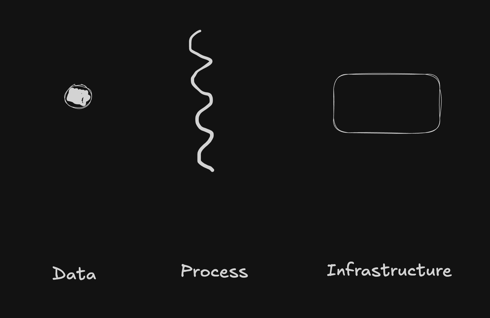
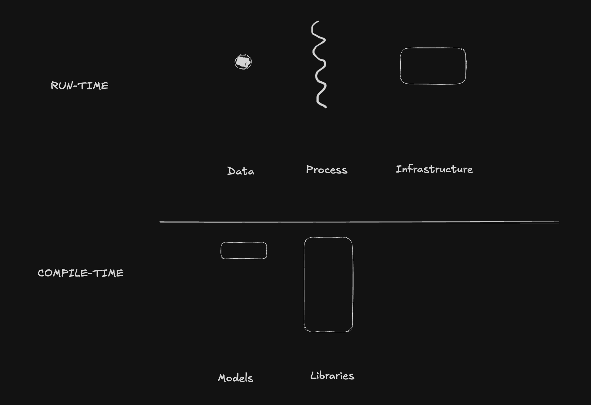
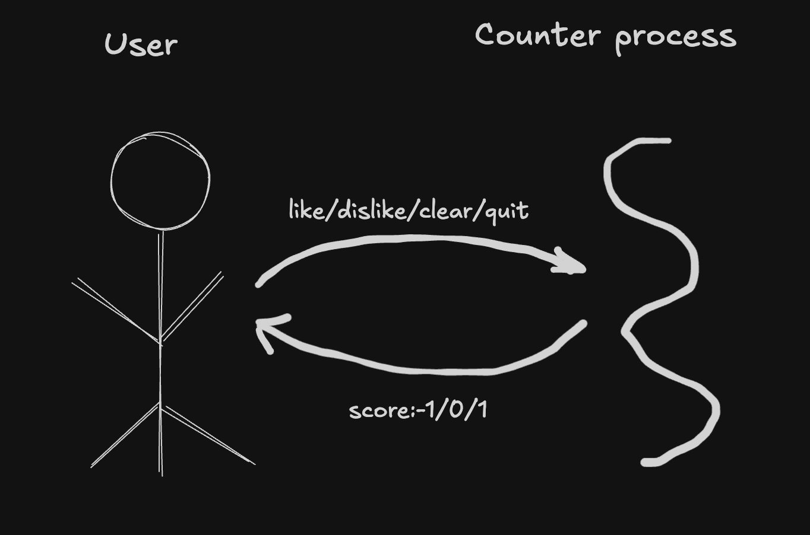
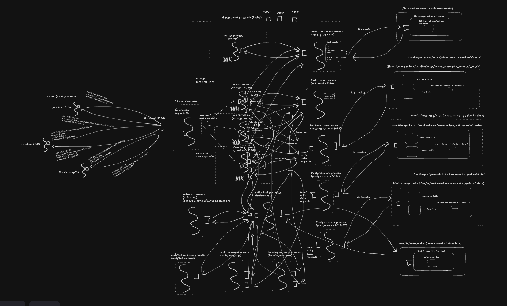

# Code is cheap, show me the System
*"Distributed systems from first principles, in the age of AI"*

At a time when non-programmers are becoming somewhat technical, and programmers are becoming product owners, the ability to understand and reason about systems is becoming more and more important. 

With data explosion, I'm seeing people getting more and more lost in the weeds, losing the sight of the forest.

Therefore, it is important for folks to have a mental model for thinking about systems.

As a result, I'm sharing my mental model for thinking about systems from first principles, hoping that both technical and non-technical folks can benefit from it.

A note on structure: I frame everything in this repo as **Problem → Product → Programming**.

- **Problem (why)** — what's broken, painful, or worth doing in the first place.
- **Product (what)** — the thing being built that addresses the problem.
- **Programming (how)** — the actual code and infrastructure that brings the product to life.

Each challenge's README extends this with two more sections — **Run It** (commands you can copy-paste) and **Notes** (trade-offs and "why this and not that" answers).

Every challenge README follows the same shape, and so does this README. Once you see the pattern, you can scan straight to the section that answers your current question.

## Who this is for

Anyone learning to build software systems who wants a mental framework for thinking about what's actually going on under the abstractions.

## Problem - What is software? 
What if I told you that everything in software is just composed of three things: 

- Run-time
    - DATA — what you store and move around
    - PROCESS — what transforms and reads/writes the data
    - INFRASTRUCTURE — what runs the process and holds the data

and yup, that pretty much covers everything.

I'm totally aware that is a gross oversimplification, but I feel like it's a good starting point to develop a mental model for thinking about existing systems / reasoning about unfamiliar systems, as you'll see in the example discussed throughout this repo.  

One more thing, if you're also interested in understanding how systems are written (large unfamiliar codebases, etc) and not just what it is doing in real life, you can slightly modify the framework to keep additional abstractions in mind: 

- Compile-time
    - MODELS — classes whose *primary role is to represent state*. Any methods they have are just accessors for that state (getters, setters, simple mutators, containment checks). Models are portable — they're the kind of thing you could serialize, store in a database, or send over the network. A model can be a single value (like a `Counter` with one vote) or a compound structure holding other models (like a `CounterStore` that holds a collection of counters).
    - LIBRARIES — classes whose *primary role is to do work*. Their methods contain processing logic that isn't just accessing their own state — things like parsing input, routing commands, doing I/O, coordinating other pieces, running loops. Libraries are bound to the process that runs them; they can't be serialized or stored.

The quick test: **if it could be written to a database/other storage infrastructure or sent over the network as JSON, it's a model. If it has to run in a process, it's a library.**

One thing worth making explicit: in an OOP codebase, **every object plays one of these two roles**. A class is either a model class (its instances represent state) or a library class (its instances do work). When we say "model instance" or "library instance," we just mean "a specific object of that kind" — it's OOP vocabulary for the same two categories. So `new Counter("video-x")` creates a *model instance*, and `new CounterHelper(...)` creates a *library instance*. The split isn't a separate dimension alongside objects; it's a way of classifying every object by what it's for.

That classification gives us more precise language in later challenges. "One library instance shared across threads" vs. "one library instance per thread" is a real design choice with real consequences (you'll see this in challenge 3). "Model instances get serialized when they cross a process boundary" is a direct statement about how data moves. Both phrases rest on the same foundation: every object is either a model or a library, and we're just asking how many of each kind exist and who uses them.

The diagram below puts compile-time (models + libraries) and run-time (data + process + infrastructure) side by side — same system, two views.

## Product - The Youtube Like/Dislike Challenge

To enforce this mental model on a real world problem, we'll use it to program the simplest possible software I could think of - a counter. But more specifically, a counter that can be used to power like/dislike functionality on social media platforms like Youtube, Reddit, etc. 

But we'll keep growing the complexity of the counter with every challenge, while maintaining the same mental model. Each challenge introduces a real problem, and the solution always changes something in the DATA, PROCESS, or INFRASTRUCTURE (usually all three), by adding more MODELS and LIBRARIES.

## Programming

Feel free to follow along the code in every incremental challenge. I would recommend to first read the README present inside every challenge directory, and then try to read and understand the code, while keeping the mental model in mind. Better yet, try to write the code yourself, and then compare your solution with the one provided in the challenge directory :)

## Why Java?

Java is the demonstration vehicle, not the point. The architectural concepts — connection pools, cache coherence, sharding, replication, task queues, event streams, circuit breakers — are language-agnostic. The same principles apply whether you reach for Go, Python, Node, or Rust; whether you swap Postgres for MySQL, Redis for Memcached, or Kafka for NATS. Java's mature ecosystem (JDBI, Lettuce, Kafka client, Resilience4j, Dropwizard) keeps the wiring concise so each challenge can focus on the concept, not on fighting the tools.

## Challenges

A 20-challenge progressive build of a YouTube-style like/dislike counter backend, from a single Java process running in a terminal to a 15-container distributed system. Each challenge introduces *one* architectural concept — sockets, HTTP, persistence, caching, pagination, observability, load balancing, sharding, replication, distributed cache, task queues, event streams, circuit breakers — by adding it to the previous challenge's code, with the full Docker Compose stack so you can run it.

**Challenge 0 — where you start.** A single Java process. One counter, one user, terminal in, terminal out.

**Challenge 15 — where you end up.** 15 containers. Sharded Postgres, Redis cache, Redis task queue with a worker, Kafka fanning a single `vote-cast` event out to three consumer groups.

### Phase 0 — Foundation (single process, in-memory, terminal)

| Challenge | Theme | What Changes |
|-----------|-------|-------------|
| [0 — One Counter, One User](./challenge-0-counter-server-process/) | One user, one counter, terminal | Server loop, model/library split. Data: a single Vote. |
| [1 — Many Counters, One User](./challenge-1-counter-server-process/) | One user voting on many counters, terminal | Identity, lookup, collections. Data: a Map<id, Counter>. |
| [2 — Many Users, Many Counters](./challenge-2-counter-server-process/) | Many users voting on many counters, terminal | Aggregation, per-user state. Data: two stores (counters + user votes), kept in sync by recomputing aggregates. |

### Phase 1 — Networking and persistence (single machine, multiple clients)

| Challenge | Theme | What Changes |
|-----------|-------|-------------|
| [3 — Multiple Clients, Concurrent Access](./challenge-3-counter-server-process/) | Many client processes talking to one server over sockets | IPC, threading, races, locking. Server spawns one thread per connection; per-counter locks keep the invariant intact. |
| [4 — HTTP](./challenge-4-counter-server-process/) | Same server, HTTP protocol on top | HTTP verbs, JSON, browser reachability. Dropwizard brings a bounded thread pool, health checks, and metrics along for the ride. |
| [5 — SQLite](./challenge-5-counter-server-process/) | Data survives process restarts | Persistence, durability, DAOs, transactions. Lock map dissolves into DB transactions. |

### Phase 2 — Production-readiness (still single machine)

| Challenge | Theme | What Changes |
|-----------|-------|-------------|
| [6 — Caching](./challenge-6-counter-server-process/) | Hot reads don't hit the DB every time | In-memory cache (Caffeine), TTL, cache-aside with write invalidation. Speed vs. freshness trade-off. |
| [7 — Pagination](./challenge-7-counter-server-process/) | `list` can't return 10 million counters | Cursor-based (keyset) pagination, ordering via `created_at`, `nextCursor` on the wire, opaque cursors. |
| [8 — Observability](./challenge-8-counter-server-process/) | "Is the system healthy?" is now answerable | Metrics (`@Timed`), JSON structured logs, MDC-threaded request IDs, health endpoints. Metrics vs logs vs traces, and why each answers a different question. |

### Phase 3 — Distributed (more than one machine)

| Challenge | Theme | What Changes |
|-----------|-------|-------------|
| [9 — Multiple Server Instances](./challenge-9-counter-server-process/) | One server can't handle all the traffic | Load balancer (nginx), N server instances as separate JVM processes, shared SQLite file. Exposes cache divergence and LB-as-new-SPOF. Processes managed manually via shell scripts — deliberately crude. |
| [9.5 — Containerization](./challenge-9.5-counter-containerized/) (tooling detour) | Managing N processes by hand is painful | Same system, different substrate. Dockerfile + Docker Compose wrap the cluster. Declarative process management replaces shell scripts. Not a distributed-systems concept — a tooling onramp that later challenges depend on. |
| [10 — Central Postgres](./challenge-10-counter-server-process/) | Servers need to agree on what the data is | Move storage off local disk to a shared DB. Introduces network round-trips, connection pools, DB as SPOF. Also introduces **schema migrations** (Flyway) — moving from SQLite to Postgres is a natural moment to stop hand-rolling `CREATE TABLE IF NOT EXISTS` and start tracking versioned schema changes. |
| 10.5 — Deploy on GKE *(planned, bonus tooling detour)* | What does this look like on real cloud infrastructure? | Take the Compose cluster from challenge 10 and run it on Google Kubernetes Engine. One YAML file (Deployments + Services), Postgres becomes Cloud SQL, real cloud LB with a public IP. Deliberately scoped to "basic manifests only" — not a K8s deep-dive. Cache divergence intentionally left for challenge 11 to fix. |
| [11 — Distributed Cache (Redis)](./challenge-11-counter-server-process/) | Per-instance caches disagree | Move cache out of process into Redis. Teaches cache coherence across instances. |

### Phase 4 — Distributed data at scale

> Note on terminology: "message queue" gets used loosely as the umbrella term for async messaging brokers. Challenges 14 and 15 split that into its two main patterns — **task queue** (point-to-point: do this job, one worker handles it) and **event stream** (pub/sub with retained history: this happened, multiple services react). They solve different problems, and real systems often run both.

| Challenge | Theme | What Changes |
|-----------|-------|-------------|
| [12 — Read Replicas](./challenge-12-counter-server-process/) | Read load exceeds what one DB can handle | Postgres replication, read/write split, replication lag, stale reads. |
| [13 — Sharding](./challenge-13-counter-server-process/) | Write load and data volume exceed one DB | Partition data by counter ID across N DBs. Hash-based routing, scatter-gather for cross-shard queries, partial-outage failure mode. |
| [14 — Task Queues](./challenge-14-counter-server-process/) | Some work shouldn't block the request path | Redis lists as a task queue + worker container. "Do this job in the background." Producer enqueues; worker dequeues, processes, retries on failure, dead-letters after N failures. Single image, multi-role pattern (counter + worker share one JAR). |
| [15 — Event-Driven Architecture (Kafka)](./challenge-15-counter-server-process/) | Many services need to react to the same thing | Kafka (KRaft mode) added *alongside* challenge 14's task queue, not replacing it. Task queue keeps doing notifications (per-task retries shine there); Kafka publishes a `vote-cast` event fanned out to three independent consumer groups — analytics (in-memory), audit (Postgres `audit.audit_log`, manual commit + idempotent insert), trending (Redis sorted set). Pub/sub, partitions, retained history, replay demo. Teaches the difference between "do this work" (task queue) and "this happened" (event stream), and why real systems run both. |
| [16 — Timeouts and Circuit Breakers](./challenge-16-counter-server-process/) | Dependencies fail; one shard down should not take down the whole system | Tight timeouts on every outbound call (Postgres `socketTimeout=2s`, Lettuce 500ms, Kafka 5s) plus Resilience4j circuit breakers — **per-shard** for Postgres, plus single instances for cache, Kafka publish, and the audit consumer's INSERT. When a shard pauses, its breaker trips and the counter returns fast 503s for that shard while other shards keep serving 200s. Cache/Kafka failures are caught locally and degrade gracefully. Live `docker pause` / `unpause` chaos demo. Same 15 containers as ch15. |
| 17 — CQRS *(planned)* | Reads and writes have different shapes | Separate read path from write path. Events drive materialized views. Builds on event streams from challenge 15. |
| 18 — Workflow Orchestration *(planned)* | Some async work is multi-step, stateful, and long-running | Temporal-style durable workflows. Activities, retries, signals, replay. For the ~10% of async work that's a real workflow (e.g., moderation with human approval across days), not just a background job. |

### Phase 5 — Advanced distributed systems (optional finale)

| Challenge | Theme | What Changes |
|-----------|-------|-------------|
| 19 — Leader Election *(planned)* | Some work has exactly one owner | Coordinate which instance runs scheduled tasks, owns a shard, etc. Introduces consensus at a high level. |
| 20 — Consensus (Raft walkthrough) *(planned)* | Multiple servers must agree on ordering | Simplified Raft: leader election + log replication. How replicated state machines actually work. |

## Caveats

A few honest disclaimers about what this repo is and isn't:

- **The terminology won't always match textbooks or industry jargon.** I'm using "model" and "library" in a specific narrow sense (state vs. work) that may not line up with how those words get used elsewhere. I'm prioritizing internal consistency over conformance.
- **The framework gives you a skeleton, not the full picture.** "Everything is data, process, and infrastructure" is true and useful — it's how you make sense of an unfamiliar system fast. But the *hard* problems in real systems live in how those three interact, fail, and evolve over time. The framework doesn't make those problems disappear; it makes them addressable, by giving you a place to point at when you ask "what's broken between which pieces?" Each challenge in this repo starts with the data/process/infra decomposition, then shows what's insufficient and what question to ask next.
- **Not every domain fits cleanly.** This framing is built around backend systems where data moves between processes over the network — stateful or stateless, single-service or distributed. Embedded systems, ML pipelines, hardware design, and graphics work all have their own dominant abstractions; you can stretch this lens to cover them, but you'll get diminishing returns. Apply where it helps, drop it where it doesn't.
- **The goal is a working mental model people can start tinkering with right away — not a technically correct book.** If you're after rigor, read the textbooks (and they're great). This repo is for building intuition fast and then earning the rigor by running things.

## Contributing

This is a teaching repo for learning backend and distributed-systems patterns from first principles. Issues and small PRs are welcome:

- **Bug reports** — a challenge doesn't run, instructions are wrong, or output doesn't match what the README claims.
- **Clarifications** — an explanation is confusing, ambiguous, or assumes knowledge it shouldn't. If something tripped you up, it probably tripped someone else up too.
- **Typos and broken links** — small PRs welcome.
- **Questions** — open an issue.

For anything larger — a new challenge, a refactor of an existing one, added tooling, style sweeps — please open an issue first to discuss. The challenges follow an intentional progression, so it helps to align on scope and approach before you write code. I'm open to contributions; I just want to avoid anyone doing work that doesn't end up fitting.

### Opening a good issue

- Which challenge (e.g. `challenge-7-counter-server-process`)
- What you ran
- What you expected vs. what actually happened
- OS / runtime version if it seems relevant
