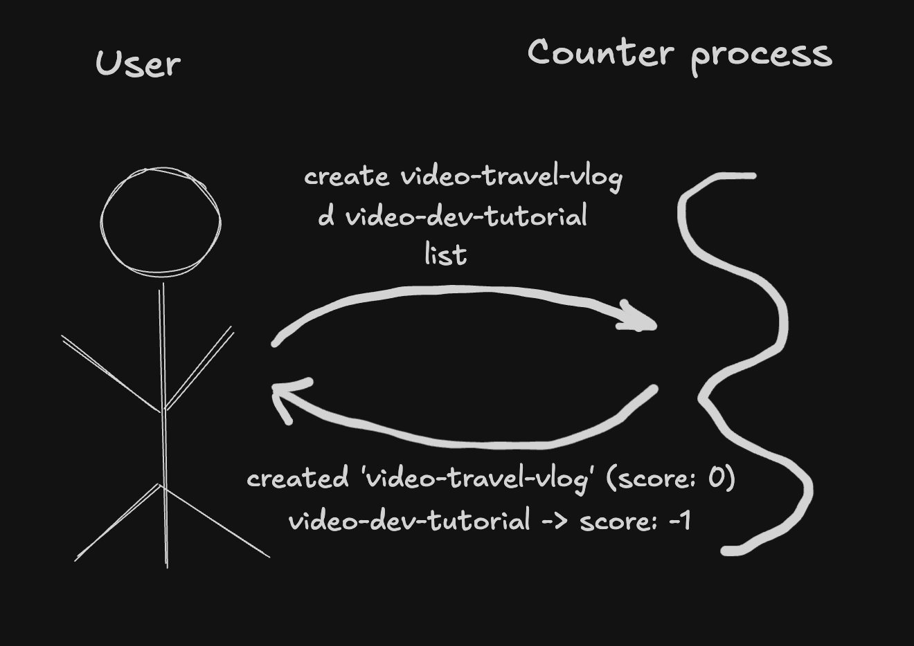

# Challenge 1 — One User, Many Counters

## Problem

In challenge 0 we had a single counter — one YouTube video, one user's vote on it. But YouTube has millions of videos, and a user has opinions on many of them. Real systems deal with *collections* of counters, not a single one.


## Product

Let's extend the terminal counter so one user can vote on many different videos. Still no network, still no database, still just one user. Only one new concept: **identity** — the counter is no longer *the counter*; it's *the counter with a specific ID*.

A terminal-based counter where one user can like, dislike, or clear their vote on any number of counters, each addressed by an ID. The system ships with a few seeded counters so there's something to interact with right away (mimicking a platform that already has some videos when you log in). The user can also create new counters, list all of them, or ask about a specific one.

Commands:
- `create <id>` — create a new counter (starts with no vote)
- `delete <id>` — delete counter `<id>`
- `l <id>` — like counter `<id>`
- `d <id>` — dislike counter `<id>`
- `c <id>` — clear your vote on counter `<id>`
- `s <id>` — show the current score of counter `<id>`
- `list` — show all counters
- `q` — quit

The rules around counter existence are strict and explicit:

- `create <id>` — errors if the counter *already exists*
- `delete <id>` — errors if the counter *doesn't exist*
- `l <id>` / `d <id>` / `c <id>` / `s <id>` — error if the counter *doesn't exist*

These rules make the counter lifecycle explicit: a counter is created, read/voted on, and eventually deleted, and each step is a dedicated command with explicit success and failure cases. Together these four operations form the **CRUD** pattern (Create, Read, Update, Delete) — a pattern that will show up in every challenge from here on.


## Programming

The thinking order stays the same as challenge 0: **runtime first** (data, process, infra), then compile-time (models, libraries).


### Run-time — What's Actually Happening



#### Data

The commands now carry an ID:

- User -> Counter server: `create video-travel-vlog`, `delete video-music-mix`, `l video-funny-cats`, `d video-dev-tutorial`, `c video-funny-cats`, `s video-music-mix`, `list`, `q`
- Counter server -> User: status strings like `"video-funny-cats -> score: 1"`, `"created 'video-travel-vlog' (score: 0)"`, `"deleted 'video-music-mix'"`, error strings like `"no such counter 'video-foo'"`, or a list of all counters

The important shift from challenge 0 is on the wire: every command that touches a counter now includes *which* counter. Without an ID, the server process has no way to tell the counters apart. There are also two new kinds of commands — `create` and `delete` — that don't just read or write an existing counter; they bring a counter into existence or remove it from the system entirely.

#### Process

Same server-process shape as challenge 0 — a single process running a `while` loop, reading commands, handling them, writing responses, looping back. Still sequential, still one user.

What's new is what happens inside each iteration of the loop:

1. Read a line from stdin.
2. Parse it into `<command>` and `<counter-id>`.
3. Look up the counter by ID.
   - For `create`: error if it already exists, otherwise add a new one to the collection.
   - For `delete`: error if it doesn't exist, otherwise remove it from the collection.
   - For `l`, `d`, `c`, `s`: error if it doesn't exist, otherwise act on it.
4. Update or read the counter's vote (or add/remove the counter itself).
5. Write the result.
6. Loop back.

The lookup step is the real new work. In challenge 0 there was one counter, always the same one. Here, the server process holds a *collection* of counters, keyed by ID, and has to find the right one for every command — or report that it's missing.

The server process also starts with some counters already in the collection. At startup it seeds three counters (`video-funny-cats`, `video-dev-tutorial`, `video-music-mix`) so the user has something to interact with right away. After that, the collection grows only through explicit `create` commands.

No network, no threads, no concurrency. Commands still arrive one at a time through stdin.

#### Infrastructure

Same as challenge 0. A single machine running a single process, attached to your terminal. The OS provides stdin/stdout.

```
                  ┌──────────────────────────────────────────────┐
                  │              Your Machine + OS               │
                  │                                              │
    User          │   stdin    ┌──────────────────────────────┐  │
     O   ───────► │  ────────► │                              │  │
    /|\           │            │    Counter Server Process    │  │
    / \           │            │                              │  │
          ◄────── │  ◄──────── │                              │  │
                  │   stdout   └──────────────────────────────┘  │
                  │                                              │
                  └──────────────────────────────────────────────┘
```

Infrastructure didn't change. Every challenge grows one or more of data/process/infra; this one grows data (wire commands carry IDs, a new map model for the collection of counters) and process (parse command with ID, look up the counter, act or error). Infra is untouched.


### Compile-Time — How to Implement It

The runtime tells us three things to translate into code:

1. The server process needs to *hold state* — not one vote anymore, but *many* votes, one per counter ID.
2. The server process needs to *do work on that state* — parse commands with IDs, look up or create counters, update them, derive scores.
3. The server process needs to *keep running in a loop* — same as challenge 0.

Challenge 0 had two libraries and one model. Challenge 1 adds *another model*:

- A **model** (`Counter`) — unchanged from challenge 0. Holds a single user's vote on a single counter.
- A **model** (`CounterStore`) — new. Holds the collection of counters keyed by ID. Its only job is to represent *the state of the system* — which counters exist, and what vote is on each. Think of it as a container model that holds other models.
- A **library** (`CounterHelper`) — takes a `CounterStore` as a dependency. Parses commands, looks up counters in the store, mutates them, prints output.
- Another **library** (`Main`) — creates the store (seeding it with initial counters), wires everything together, runs the loop.

The key split is between *storage* (what state exists — the two models) and *behavior* (what we do with it — the two libraries). `CounterStore` owns "the collection of counters"; `CounterHelper` owns "what happens when a user sends a command." That separation matters because in later challenges the storage mechanism changes (a database takes over), while the command-handling mechanism mostly doesn't. Splitting them here means later challenges become small changes, rather than entire rewrites. 

The fact that `Counter` model doesn't change is worth noticing. We designed it in challenge 0 as "the state of one user's vote on one counter" — not "the state of the one counter in the system." That naming paid off immediately: we can now have many of them, each wrapped in the new `CounterStore`.

#### The model: `Counter`

Exactly the same as challenge 0:

```java
public class Counter {
    public enum Vote { LIKE, DISLIKE, NONE }
    private Vote myVote = Vote.NONE;

    public Vote getMyVote() { return myVote; }
    public void setMyVote(Vote vote) { this.myVote = vote; }
}
```

One vote per `Counter`. One `Counter` per video. To have many videos, we'll have many `Counter` instances — and we need somewhere to put them all.

#### The model: `CounterStore`

A compound model that holds the collection of counters keyed by ID. It's still a *model* — its primary role is to represent state. The methods it exposes (`get`, `has`, `add`, `remove`, `entries`) are all accessors for its own state (the internal map), not processing logic:

```java
public class CounterStore {
    private final Map<String, Counter> counters = new LinkedHashMap<>();

    public Counter get(String id) { return counters.get(id); }
    public boolean has(String id) { return counters.containsKey(id); }
    public void add(String id, Counter counter) { counters.put(id, counter); }
    public void remove(String id) { counters.remove(id); }
    public Set<Map.Entry<String, Counter>> entries() { return counters.entrySet(); }
    public boolean isEmpty() { return counters.isEmpty(); }
}
```

A few things worth noticing:

1. **It's a model even though it has methods.** The rule for models isn't "no methods" — it's "methods are just accessors for the object's own state." `get`, `has`, `add`, `remove` all fit that: they read or update the collection, they don't do any processing like parsing, I/O, or routing.
2. **It's a compound model — a model containing other models.** `CounterStore` holds a `Map<String, Counter>`, and each `Counter` is itself a model. This is a normal and useful shape: a shopping cart holds line items, a feed holds posts, a store holds counters. Nesting models is fine.
3. **It passes the portability test.** Models should be the kind of thing that could cross a process boundary. You could serialize a `CounterStore` to JSON, or store its contents as rows in a database table. It's data, not code.
4. **The storage mechanism is hidden behind the interface.** Right now it's a `LinkedHashMap`. In later challenges, the internals will change — the map might be backed by a SQL table, a cache, or a remote server process. As long as `get`/`has`/`add`/`remove` keep behaving the same way, everything that uses `CounterStore` (which is just `CounterHelper`) doesn't have to change.

#### The library: `CounterHelper`

Takes the `CounterStore` as a dependency. Parses commands, calls the store to look things up or change them, prints output:

```java
public class CounterHelper {
    private final CounterStore store;
    private final Scanner scanner;

    public CounterHelper(CounterStore store, Scanner scanner) { ... }

    public String readCommand() { ... }
    public boolean handle(String line) { ... }   // parses "<cmd> <id>", asks store, prints result
}
```

Three things worth noticing:

1. **The helper doesn't own the collection.** `CounterStore` owns it; the helper just uses it. The helper never touches the underlying `Map` — it goes through the store's interface (`get`, `has`, `add`, `remove`) for every operation. That's the storage-vs-behavior split: storage knows how to hold and look up counter models, behavior knows what to do in response to a command.
2. **The model is still separate.** `CounterStore` doesn't know anything about commands, parsing, or I/O. `Counter` doesn't know anything about collections. The *collection logic* lives on the store, the *command logic* lives in the helper. Each piece does one job.
3. **Our library sits next to an external one.** `CounterHelper` is library code we wrote; `java.util.Scanner` is library code the JDK provides. Both play the same role — processing logic with some internal state — and `CounterHelper` takes both of them as dependencies in its constructor (the store and the scanner). The distinction between "library I wrote" and "library I imported" is cosmetic (who packaged it), not structural — they both fit the same slot in the mental model.

#### Another library: `Main`

Creates the store, seeds it with starting counters, creates the helper, runs the loop:

```java
public static void main(String[] args) {
    CounterStore store = new CounterStore();
    store.add("video-funny-cats",    new Counter());
    store.add("video-dev-tutorial",  new Counter());
    store.add("video-music-mix",     new Counter());

    Scanner scanner = new Scanner(System.in);
    CounterHelper helper = new CounterHelper(store, scanner);

    while (true) {
        String line = helper.readCommand();
        if (!helper.handle(line)) return;
    }
}
```

Seeding happens in `Main` because it's a startup choice, not a property of the store itself. The store doesn't know or care where its initial contents came from — which is exactly what we'd want when the store eventually becomes a database (the rows are already there; nobody seeds them in code).


## Run It

```bash
cd challenge-1-counter-server-process
javac Counter.java CounterStore.java CounterHelper.java Main.java
java Main
```

Try:

```
list
l video-funny-cats
d video-dev-tutorial
l video-nonexistent
create video-travel-vlog
l video-travel-vlog
delete video-music-mix
list
q
```

You'll see the three seeded counters at startup, votes on them, an error when you try to vote on a counter that doesn't exist, an explicit create followed by a vote on the new counter, then a delete that removes one of the seeded counters — with the final `list` showing the resulting state.


## What's Missing

- **Multiple users** — still one user, so each counter's score can only be -1, 0, or +1. A real like system has many users whose votes aggregate into totals like "47 likes, 3 dislikes." That's challenge 2.
- **Network access** — the terminal is still the only interface. Browsers and other machines can't reach this server process. That's challenge 3.
- **Persistence** — quit the process and every counter disappears.
- **Concurrency** — not a concern yet, because one user + stdin means commands arrive sequentially.


## Notes

A few things worth noticing about this design:

- **`Counter` is still portable.** Each `Counter` is self-contained state. You could serialize one to JSON, stash it in a database (eventually), or hand it to another process. The library holds them in a map, but the model doesn't care about that.
- **The map is just an implementation choice.** `LinkedHashMap<String, Counter>` keeps counters in insertion order (so `list` shows the seeded ones first). In later challenges, this lookup will be replaced by a database query, a cache, or a distributed hash table. The *concept* stays the same — "given an ID, find the Counter" — only the mechanism changes.
- **Identity is a real concept now.** Challenge 0 had one counter, so there was nothing to distinguish. Challenge 1 introduces IDs as first-class names the wire protocol, the library, and the user all share. Every challenge from here on will have identity somewhere in its data model.
- **Lifecycle is now a visible concept.** A counter has to be *created* before it can be voted on, and it can be *deleted* to remove it from the system. Creating, voting, showing, and deleting are four different commands doing four different things, which maps directly to the CRUD pattern (Create, Read, Update, Delete) you'll see in every future challenge: `POST` / `GET` / `PUT` / `DELETE` in HTTP, `INSERT` / `SELECT` / `UPDATE` / `DELETE` in SQL.
- **Seeded state models a realistic starting point.** In real platforms, when you log in there are already counters you can vote on — videos already uploaded, posts already written. Seeding three counters at startup mimics that. You're not creating the world from scratch; you're joining a world that already exists.
- **No concurrency still.** Even though we have "many counters," commands still arrive one at a time from stdin. There's no race between two updates to the same counter, because there's only one user and one command loop. That changes when HTTP shows up in challenge 3.
