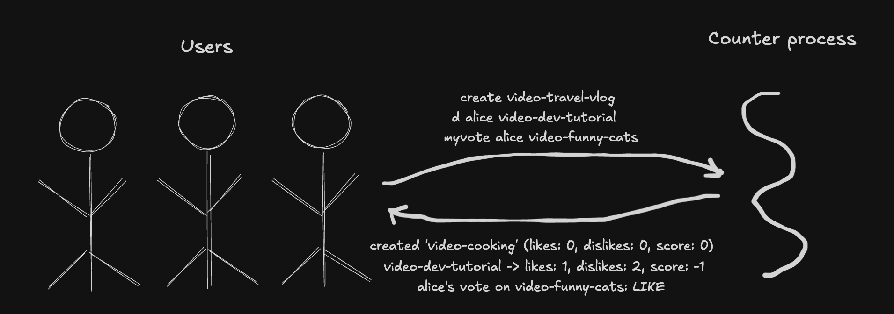

# Challenge 2 — Many Users, Many Counters

## Problem

In challenge 1, one user voted on many counters. But real platforms have many users. A YouTube video has thousands of viewers, each with their own opinion, and the like count you see is the *sum* of all those opinions.

Up until now we've been cheating: "my vote" and "the counter's state" looked like the same thing because there was only one user. With many users, those two concepts split apart:

- **The counter's state** — an aggregate that everyone sees the same way (e.g. "142 likes, 8 dislikes"). This is what YouTube prints under the video.
- **A user's vote** — one user's individual opinion on one counter (e.g. "alice liked it"). This is private per-user data.

One is public, summed, and everyone agrees on it. The other is private to the user and only they see it directly. Challenge 2 is about representing both, cleanly, and keeping them in sync when anyone votes.


## Product

A terminal-based counter where every vote command explicitly names *which user* is voting. The score on any counter aggregates votes across *all* users.

No login, no session, no current-user state. User identity rides along on every command. This matches how real systems actually work — HTTP requests carry user context (headers, tokens), database writes record the user ID, message queues tag messages with their origin. Identity per command, not per session.

The system ships with three seeded counters, two of which already have seeded votes from `alice` and `bob`, so aggregation is visible as soon as you run `list`.

### Commands

- `create <counter-id>` — create a new counter
- `delete <counter-id>` — delete a counter (also removes all its user votes)
- `l <user-id> <counter-id>` — user likes the counter
- `d <user-id> <counter-id>` — user dislikes the counter
- `c <user-id> <counter-id>` — user clears their vote
- `s <counter-id>` — show counter aggregates (likes, dislikes, score)
- `myvote <user-id> <counter-id>` — show a user's vote on this counter (the kind of query a user would make about their own vote)
- `list` — show all counters with aggregates
- `q` — quit

Rules:

- User IDs are any string — there's no authentication. A real system would verify identity with a password or token; we're not modeling security here.
- Same existence rules as challenge 1: can't create what exists, can't vote on / show / delete what doesn't.
- Clearing a vote (`c`) removes the user's `UserVote` entirely. Absence means "no vote" — there's no such thing as a stored "cleared" vote.


## Programming

Same thinking order: **runtime first** (data, process, infra), then compile-time (models, libraries).


### Run-time — What's Actually Happening



#### Data

The commands now explicitly name both the user and the counter:

- User -> Counter server: `l alice video-funny-cats`, `d bob video-dev-tutorial`, `c alice video-funny-cats`, `myvote alice video-funny-cats`, `list`, `q`
- Counter server -> User: response strings like `video-funny-cats -> likes: 3, dislikes: 0, score: 3`, or per-user queries like `alice's vote on video-funny-cats: LIKE` and `dave has no vote on video-funny-cats`, or errors like `no such counter 'video-nope'`.

Two big shifts from challenge 1 on the wire:

1. **Responses now carry aggregates** (`likes: 3, dislikes: 0, score: 3`) instead of a single `-1/0/1`. The counter's state is multi-dimensional now — likes and dislikes can grow independently as different users vote.
2. **Every vote command carries a user ID.** The identity isn't implicit — the client (in this case, you at the terminal) has to say *who* is voting on every action.

Each command is self-contained: `l alice video-funny-cats` is a complete request. This matches how HTTP requests work in challenge 4 — each request includes its own user context.

#### Process

Same server process shape as before: a single process running a `while` loop, reading commands, handling them, writing responses, looping back.

What's new inside each loop iteration:

1. Read a line from stdin.
2. Parse `<command> [args...]`. Vote commands have two args (user + counter); other commands have one or zero.
3. Depending on the command:
   - `create` / `delete` → modify the counter collection; for `delete`, also wipe all that counter's user votes.
   - `l` / `d` / `c` → update that user's vote on the counter, then **recompute the counter's aggregate counts** from the user-vote collection.
   - `s` → read aggregates.
   - `myvote` → look up one user's vote on one counter (a single entry from the per-user store).
   - `list` → read all counter aggregates.
4. Write the response.
5. Loop back.

The new work is **keeping two collections in sync**. A system-level invariant holds: for every counter, its `likes` and `dislikes` must equal the counts of corresponding entries in the user-vote collection. Whenever a user's vote changes, the counter's aggregates need to be updated so the invariant holds again. *How* this happens (recomputing vs. tracking deltas, which data structures get touched, etc.) is a library-level concern — see the `CounterHelper` section below.

The system also starts up with seeded state so there's something to interact with immediately — three counters, two with existing votes. Details of the seeding live in the `Main` library.

No network, no threads, no concurrency. Still sequential — this is important. When challenge 3 adds real concurrency, the sync step becomes a race hazard (two users voting at the same time can both see a stale view of the user votes and both write wrong aggregates). For now, the single-threaded loop means every update runs to completion before the next command starts, so the invariant always holds.

#### Infrastructure

Same as challenges 0 and 1 — one process on your machine, attached to your terminal, using stdin/stdout.

```
                  ┌──────────────────────────────────────────────┐
                  │              Your Machine + OS               │
                  │                                              │
    User          │   stdin    ┌──────────────────────────────┐  │
     O   ───────► │  ────────► │                              │  │
    /|\           │            │    Counter Server Process    │  │
    / \           │            │                              │  │
          ◄────── │  ◄──────── │                              │  │
                  │   stdout   └──────────────────────────────┘  │
                  │                                              │
                  └──────────────────────────────────────────────┘
```

Infrastructure didn't change. This challenge grows data (aggregates on the wire, user IDs on every vote, two collections in memory) and process (aggregate recomputation, per-user state tracking). Infra is untouched.


### Compile-Time — How to Implement It

The runtime tells us what needs to exist in code:

1. Two kinds of state to hold: **aggregate counter state** (shared, visible to everyone) and **per-user vote state** (each user's opinion on each counter).
2. A way to find either by the relevant key — by `counterId` for counters, by `(counterId, userId)` for user votes.
3. Behavior that coordinates updates to both when a user's vote changes.
4. The same loop we've always had, plus seeding.

These map to **four models** (two state shapes, two collections) and **two libraries**:

- **Model** `Counter` — redefined. Now holds `counterId`, `likes`, `dislikes`. No more `Vote` field (that was a single-user shortcut).
- **Model** `UserVote` — new. Holds `counterId`, `userId`, `vote` (one of `LIKE`, `DISLIKE`). A user with no vote is represented by *absence* of a `UserVote` entry, not by a third enum value.
- **Model** `CounterStore` — holds the counter collection. Same shape as challenge 1.
- **Model** `UserVoteStore` — new. Holds the user-vote collection keyed by `(counterId, userId)`.
- **Library** `CounterHelper` — parses commands, updates both stores, recomputes aggregates.
- **Library** `Main` — creates the stores, seeds them, runs the loop.

#### Breaking change worth flagging: `Counter` is no longer "my vote"

In challenges 0 and 1, `Counter` had a `Vote myVote` field. That was a simplification that only made sense when there was one user: "my vote" and "the counter's state" were the same thing.

With many users they're genuinely different. `Counter` now represents the aggregate everyone sees; `UserVote` represents one user's piece. Conflating them into a single class would be wrong — they have different lifecycles, different visibility, and in challenge 5 they'll live in different database tables.

This is the whole point of challenge 2: *forcing apart two concepts that were accidentally fused*.

#### The model: `Counter`

Now purely about aggregate state:

```java
public class Counter {
    private final String counterId;
    private int likes;
    private int dislikes;

    public Counter(String counterId) { this.counterId = counterId; }
    public String getCounterId() { return counterId; }
    public int getLikes() { return likes; }
    public void setLikes(int likes) { this.likes = likes; }
    public int getDislikes() { return dislikes; }
    public void setDislikes(int dislikes) { this.dislikes = dislikes; }
    public int getScore() { return likes - dislikes; }
}
```

No `Vote` enum, no `myVote`. Just the counts that every viewer sees the same way. `getScore` is a derived accessor (still a model method — it computes from its own state).

#### The model: `UserVote`

New. One row per (counter, user) pair, with the vote they cast:

```java
public class UserVote {
    public enum Vote { LIKE, DISLIKE }

    private final String counterId;
    private final String userId;
    private Vote vote;

    public UserVote(String counterId, String userId, Vote vote) { ... }
    // getters + setter for vote
}
```

The `Vote` enum lives here now — it's a user's vote, after all. Two values: `LIKE` and `DISLIKE`. There's deliberately no `NONE` value; "no vote" is represented by the *absence* of a `UserVote` in the store, not by a third enum state. This matches how the data will eventually live in a database — there's no row for users who haven't voted.

A few things worth noticing:

1. **`counterId` and `userId` together form the key.** This is a composite key. In challenge 5 when we add a database, this becomes `PRIMARY KEY (counter_id, user_id)` on the `user_votes` table. Each user has at most one vote per counter.
2. **The vote value is mutable.** Users can change their minds (`LIKE` → `DISLIKE`). The model supports this by letting the `vote` field be updated. When a user clears their vote, we remove the `UserVote` entirely — absence means "no vote."

#### The model: `CounterStore`

Same as challenge 1, unchanged. Still a `Map<String, Counter>` keyed by counter ID with accessor methods.

#### The model: `UserVoteStore`

The new collection model, analogous to `CounterStore` but keyed by `(counterId, userId)`:

```java
public class UserVoteStore {
    private final Map<String, UserVote> votes = new LinkedHashMap<>();

    private static String keyOf(String counterId, String userId) { ... }

    public UserVote get(String counterId, String userId) { ... }
    public boolean has(String counterId, String userId) { ... }
    public void put(UserVote vote) { ... }
    public void remove(String counterId, String userId) { ... }
    public int countByCounterAndVote(String counterId, UserVote.Vote voteType) { ... }
    public List<UserVote> getByCounter(String counterId) { ... }
    public void removeByCounter(String counterId) { ... }
    public boolean isEmpty() { ... }
}
```

Three things worth noticing:

1. **The composite key is an internal detail.** Callers use `(counterId, userId)` as two separate arguments; the store packs them into a string internally. Callers never see the string key. If we later decide to use a proper `record Key(String counterId, String userId)`, no caller has to change.
2. **Query methods like `countByCounterAndVote` are still model methods.** They're *queries* over the store's own state, not processing logic. They iterate the internal map, filter by criteria, and return a count. No parsing, no I/O, no routing. This is exactly the kind of accessor a model can offer — the in-memory equivalent of `SELECT COUNT(*) FROM user_votes WHERE counter_id = ?`.
3. **`removeByCounter` exists for the delete cascade.** When a counter is deleted, all its user votes should go too. The `UserVoteStore` exposes a bulk removal for that case — the helper calls it after removing the counter from `CounterStore`. In the eventual SQL version, this becomes `DELETE FROM user_votes WHERE counter_id = ?`, or it's automatic via `ON DELETE CASCADE` on the foreign key.


#### The library: `CounterHelper`

The piece that coordinates everything. Takes both stores plus the scanner as dependencies. No session state — every vote command carries its own user ID.

```java
public class CounterHelper {
    private final CounterStore counters;
    private final UserVoteStore votes;
    private final Scanner scanner;

    public CounterHelper(CounterStore counters, UserVoteStore votes, Scanner scanner) { ... }

    public String readCommand() { ... }
    public boolean handle(String line) { ... }   // parses, looks things up, mutates, recomputes, prints

    private void recomputeAggregates(Counter c) {
        c.setLikes(votes.countByCounterAndVote(c.getCounterId(), UserVote.Vote.LIKE));
        c.setDislikes(votes.countByCounterAndVote(c.getCounterId(), UserVote.Vote.DISLIKE));
    }
}
```

Three things worth noticing:

1. **The helper is stateless with respect to user identity.** There's no `currentUser` field. Every vote command carries its own user ID as an argument, and the helper uses it once to update the `UserVoteStore`, then discards it. This matches exactly how HTTP handlers work in challenge 4 — each request carries a user header, the handler uses it for that request, no session state on the server.
2. **The helper owns the sync contract.** When a user's vote changes, the helper is responsible for updating the `UserVoteStore` *and* recomputing the corresponding `Counter`'s aggregates. The stores themselves don't know about each other. Consistency is a behavior the helper provides — it lives in the library layer, not the model layer.
3. **Recompute-not-delta is a deliberate choice.** A cleverer implementation would track whether the user's vote changed from LIKE to DISLIKE and apply a `+1, -1` delta to the counts. Recomputing by counting is slightly more expensive but has no bugs — no corner cases for "was there an old vote? what was it? did the new vote differ?" Every change just asks the truth: "how many LIKE entries are there now for this counter? How many DISLIKE?" In challenge 5 when a database comes in, this is literally what real systems do: `UPDATE counters SET likes = (SELECT COUNT(*) FROM user_votes WHERE counter_id = ? AND vote = 'LIKE')`. And in challenge 3 when concurrency enters, the same approach is actually *more* robust against races — as long as the read and recompute sit inside a lock, they'll always see a consistent view.

#### The library: `Main`

Creates both stores, seeds them with initial counters and user votes, recomputes the aggregates once so the seeded data is consistent, then runs the loop. Nothing new conceptually; just more setup because there's more state to bootstrap.

```java
public static void main(String[] args) {
    CounterStore counters = new CounterStore();
    UserVoteStore votes = new UserVoteStore();

    counters.add("video-funny-cats",    new Counter("video-funny-cats"));
    counters.add("video-dev-tutorial",  new Counter("video-dev-tutorial"));
    counters.add("video-music-mix",     new Counter("video-music-mix"));

    votes.put(new UserVote("video-funny-cats",   "alice", UserVote.Vote.LIKE));
    votes.put(new UserVote("video-funny-cats",   "bob",   UserVote.Vote.LIKE));
    votes.put(new UserVote("video-dev-tutorial", "alice", UserVote.Vote.LIKE));
    votes.put(new UserVote("video-dev-tutorial", "bob",   UserVote.Vote.DISLIKE));

    for (var e : counters.entries()) {
        Counter c = e.getValue();
        c.setLikes(votes.countByCounterAndVote(c.getCounterId(), UserVote.Vote.LIKE));
        c.setDislikes(votes.countByCounterAndVote(c.getCounterId(), UserVote.Vote.DISLIKE));
    }

    Scanner scanner = new Scanner(System.in);
    CounterHelper helper = new CounterHelper(counters, votes, scanner);
    // print commands, run the loop
}
```

The seeding lives here (not in a store) because it's a startup choice, not a property of the store itself. If the store eventually becomes a database, the rows are already there — nobody seeds them in application code.


## Run It

```bash
cd challenge-2-counter-server-process
javac Counter.java UserVote.java CounterStore.java UserVoteStore.java CounterHelper.java Main.java
java Main
```

Try:

```
list
myvote alice video-funny-cats
myvote dave video-funny-cats
l charlie video-funny-cats
myvote charlie video-funny-cats
c alice video-funny-cats
myvote alice video-funny-cats
s video-funny-cats
create video-cooking
l dave video-cooking
myvote dave video-cooking
delete video-music-mix
list
q
```

You'll see:
- Three seeded counters, two already showing non-zero aggregates from Alice and Bob's seeded votes.
- `myvote alice video-funny-cats` returns Alice's seeded LIKE.
- `myvote dave video-funny-cats` tells you Dave hasn't voted on it.
- Charlie liking `video-funny-cats` bumps the aggregate from 2 to 3.
- Alice clearing her vote drops the aggregate back to 2; her `myvote` query now reports "no vote."
- `s` shows only the aggregate (that's what a viewer sees on the platform).
- `delete` removes the counter *and* its user votes — the per-counter cascade.


## What's Missing

- **Real concurrency** — commands still arrive sequentially through stdin. Two users can't actually vote at the same time. That's challenge 3: separate client processes connecting to the server over sockets, with real threads racing to update the same counter.
- **Network access** — the terminal is still the only interface. Challenge 4 adds HTTP.
- **Persistence** — quit the process and every counter and vote disappears. Challenge 5 adds SQLite.
- **Authentication** — the user ID on every command is trusted as-is. Anyone can claim to be anyone. Real systems need tokens, passwords, or certificates to verify identity. We're skipping that concern for now.


## Notes

A few things worth noticing about this design:

- **Two stores, one invariant.** The invariant is: for every counter, its `likes` / `dislikes` equal the count of matching entries in `UserVoteStore`. The helper maintains this invariant by recomputing after every vote change. This is the central correctness contract of the system. In challenge 3, we'll see it break under concurrent access — and that's exactly what locks fix.
- **Identity per command, not per session.** Every vote command carries its own user ID. This matches how HTTP, database writes, and message queues actually attach identity in real systems. Sessions (as in cookies or JWTs) are a separate concept — a convenience for humans using a client — and belong much further up the stack. We're modeling the underlying request/data layer, where identity always rides with the operation.
- **`CounterStore` didn't need to change.** The same interface from challenge 1 still works. That's a sign the abstraction is good: new requirements (multi-user) led to adding a new model (`UserVoteStore`) alongside, not rewriting the existing one.
- **`Counter`'s breaking change is a feature, not a bug.** Removing `Vote myVote` from `Counter` is backwards-incompatible with challenge 1. But it's the right call — the single-user shortcut we took earlier had to break once multiple users entered the picture. Software evolution often means pushing bad abstractions apart, not just adding new ones.
- **The enum shape follows the data shape.** In challenges 0 and 1, `Counter.Vote` had a `NONE` value because `Counter` held a single `Vote myVote` field that always needed *some* value. Here, votes live as entries in a map — "no vote" is represented by the key's absence, so `NONE` is no longer needed and the enum shrinks to just `{ LIKE, DISLIKE }`. Same concept, different representation, driven by the change in data structure. The design of a type isn't a universal choice — it falls out of the container that holds it.
- **No fake auth.** Earlier drafts of this challenge had a `login` command that just set a string with no verification. Dropping that and putting user ID on every command is more honest — we're not pretending to model security, just identity-tagging.
- **`myvote` models what a real system would expose.** On a real platform, other users' individual votes are private — you see the aggregate, you see *your own* vote, but not anyone else's. The `myvote` command reflects that shape: it returns one user's vote on one counter, not a dump of everyone's votes. In a real API, the requester would be authenticated, and the endpoint would only let you query your *own* vote — never someone else's. Our terminal has no authentication, so the user ID is passed as an argument; but the operation still matches the real-world shape: one lookup, one answer.
- **The model/library split mirrors the future DB boundary.** Four models map to two tables (`counters` and `user_votes`); two libraries stay application code. When challenge 5 introduces SQLite, the models become rows, the stores become DAOs, and the helper barely changes. That clean boundary is the payoff for the separation we built here.


## Trade-off: Recompute vs. Delta-Tracking

The helper rebuilds the aggregate counts from scratch on every vote change. A cleverer-looking alternative is to track just the *change* and apply it to the existing totals. Both work. They trade off against each other along a single axis — **performance vs. correctness risk** — and the right choice depends on which side of that axis you care about more. This section walks through both approaches so the trade-off is concrete.

### The clever idea: delta-tracking

Instead of recomputing the totals from scratch after every vote change, you track just the difference (the "delta") between the old and new state, and apply it to the existing totals.

If a counter has `likes = 5, dislikes = 2` and Alice votes LIKE, you don't need to re-count all the users. You just do `likes = likes + 1`.

### Concrete examples

Say `video-funny-cats` starts at `likes = 5, dislikes = 2`.

**Case 1: Alice (no prior vote) likes it**
- old vote: none
- new vote: LIKE
- delta: `likes +1, dislikes +0`
- result: `likes = 6, dislikes = 2` ✓

**Case 2: Alice changes her mind — LIKE becomes DISLIKE**
- old vote: LIKE
- new vote: DISLIKE
- delta: `likes -1, dislikes +1`
- result: `likes = 5, dislikes = 3` ✓

**Case 3: Alice clears her DISLIKE**
- old vote: DISLIKE
- new vote: none
- delta: `likes +0, dislikes -1`
- result: `likes = 5, dislikes = 2` ✓

The "clever" code looks roughly like:

```java
void applyVote(String counterId, String userId, Vote newVote) {
    UserVote oldVote = userVoteStore.get(counterId, userId);  // might be null
    int dLikes = 0, dDislikes = 0;

    if (oldVote != null && oldVote.getVote() == LIKE)    dLikes--;
    if (oldVote != null && oldVote.getVote() == DISLIKE) dDislikes--;
    if (newVote == LIKE)    dLikes++;
    if (newVote == DISLIKE) dDislikes++;

    Counter c = counterStore.get(counterId);
    c.setLikes(c.getLikes() + dLikes);
    c.setDislikes(c.getDislikes() + dDislikes);

    userVoteStore.put(new UserVote(counterId, userId, newVote));
}
```

Work per vote: **constant time** (just a few adds/subtracts). Fast.

### Why it's worse than recompute

Compare to what our code actually does:

```java
void applyVote(...) {
    userVoteStore.put(new UserVote(counterId, userId, newVote));
    counter.setLikes(userVoteStore.countByCounterAndVote(counterId, LIKE));
    counter.setDislikes(userVoteStore.countByCounterAndVote(counterId, DISLIKE));
}
```

Work per vote: **O(N)** — iterates all user votes each time. Slower.

So the delta approach is faster. What's the catch?

Look at how many cases the delta code has to handle:

| Old vote | New vote | What happens |
|----------|----------|--------------|
| none | LIKE | likes +1 |
| none | DISLIKE | dislikes +1 |
| LIKE | none | likes -1 |
| DISLIKE | none | dislikes -1 |
| LIKE | DISLIKE | likes -1, dislikes +1 |
| DISLIKE | LIKE | likes +1, dislikes -1 |
| LIKE | LIKE | no change |
| DISLIKE | DISLIKE | no change |

Eight cases. Miss one, swap a sign, get the order wrong (do you read the old vote *before* or *after* updating the store?) — you've got a bug. And these bugs are silent: counts drift by one over time, nobody notices until someone spots "wait, 47 + 8 - 12 ≠ 44 from the actual votes."

Recompute has one case: "count the current state." No branches, no signs, no order-dependence. Slower, but foolproof.

### When each is the right choice

- **Delta** — when performance matters (millions of votes per second, can't afford to recount every time).
- **Recompute** — when correctness matters more than speed (or when the count is small enough that O(N) is fine).

For this learning repo, and honestly for most apps until they hit real scale, recompute wins. That's why `recomputeAggregates` is "a deliberate choice" — we're not accidentally using the slower approach, we're choosing it.
