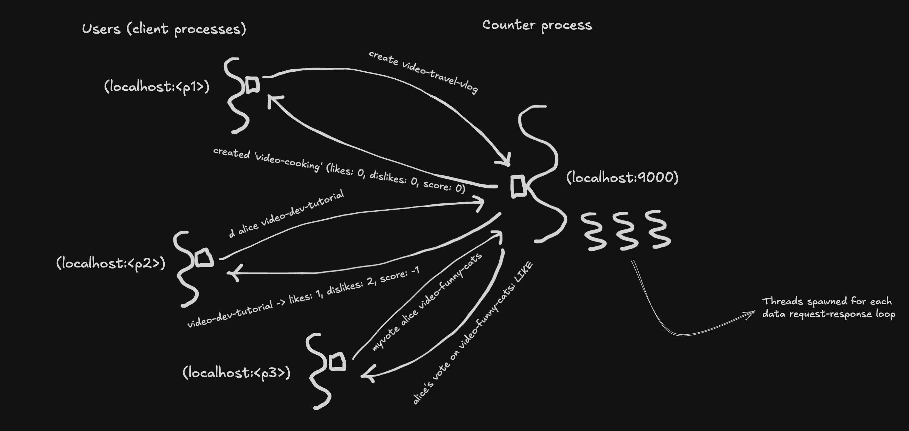

# Challenge 3 — Multiple Clients, Concurrent Access

## Problem

Through challenge 2, the server has been a single-terminal affair — one user at a time, typing commands through stdin. That's not how real systems look. Real systems have many users interacting with the same system at the same time, each from their own terminal or browser or app, all seeing and changing the same shared state.

Challenge 3 is about making that real. Many clients, one server, all running at the same time.


## Product

Two separate programs:

- **Server** — one server process. Holds the counters and user votes in memory, listens on `localhost:9000`, serves any client process that connects.
- **Client** — a client process you start in a different terminal. Connects to the server process, reads commands from your stdin, forwards them to the server process, prints the responses.

You can run many clients against one server. Each client is its own process, its own terminal, its own voice — but they're all interacting with the same shared state mangaged by the server process. Ex - likes that Alice casts from her client process are visible to Bob's client process as soon as Bob runs `list`.

### Commands

The same grammar as challenge 2 — commands are just text lines sent over the socket:

- `create <counter-id>` — create a new counter
- `delete <counter-id>` — delete a counter
- `l <user-id> <counter-id>` — user likes the counter
- `d <user-id> <counter-id>` — user dislikes the counter
- `c <user-id> <counter-id>` — user clears their vote
- `s <counter-id>` — show counter aggregates
- `myvote <user-id> <counter-id>` — show a user's vote on the counter
- `list` — show all counters
- `q` — disconnect (closes this client's connection; server keeps running)

The system ships with three seeded counters, two of which already have seeded votes from `alice` and `bob`.


## Programming

Same thinking order: **runtime first** (data, process, infra), then compile-time (models, libraries).

Two new concepts force themselves into the picture the moment we go multi-user-for-real:

1. **IPC (inter-process communication)** — clients and the server are separate OS processes. They need a way to talk. Until now, stdin/stdout was our wire. Now we need a real transport.
2. **Concurrency** — with multiple clients processes connected at once, multiple threads are running inside the server process, all touching the same `CounterStore` and `UserVoteStore` models. Read-modify-write sequences that were safe in single-threaded code (because only one main thread was running inside the server process) can now race. Counts drift. The invariant breaks.

Challenge 3 introduces both. IPC via TCP sockets (same grammar as challenge 2, now flowing over a socket instead of stdin). Concurrency via one-thread-per-connection on the server process. And because races arise immediately, per-counter locks to keep the invariant intact.


### Run-time — What's Actually Happening



#### Data

Same grammar as challenge 2, now flowing over a TCP socket instead of stdin:

- Client → Server: `l alice video-funny-cats\n`, `create video-cooking\n`, `list\n`, etc. Lines terminated by `\n`.
- Server → Client: response lines, terminated by a blank line (that's how the client knows where one response ends and the next begins).

A single-line response looks like:

```
video-funny-cats -> likes: 3, dislikes: 0, score: 3

```

(one content line, one blank line).

A multi-line response (`list`) looks like:

```
video-funny-cats -> likes: 3, dislikes: 0, score: 3
video-dev-tutorial -> likes: 1, dislikes: 1, score: 0
video-music-mix -> likes: 0, dislikes: 0, score: 0

```

(three content lines, one blank line). This is a tiny framing convention: **the blank line is the end-of-response marker.** The client reads lines and prints them until a blank line appears, then prompts for the next command. Dead simple; works for one-line and many-line responses the same way.

##### Why framing is new here

Challenge 2 didn't need any of this. Commands came from stdin (you pressed Enter → `Scanner.nextLine()` returned a line), and responses went to stdout (rendered on your terminal for your eyes to read). The "protocol" between you and the program was managed by the OS and the terminal, and you were reading output with your eyes — *you* could tell when a response was done just by seeing the `>` prompt come back. No code had to figure that out.

Challenge 3 replaces "your eyes" with another program (the client process). Code can't look at text and intuit "this seems complete"; it needs a rule. So we impose one:

- **`\n` terminates commands** — so the server knows "this command is complete, act on it now." The server uses `BufferedReader.readLine()`, which reads bytes until it sees `\n` and then returns.
- **blank line terminates responses** — so the client knows "the server is done sending; I can prompt the human for the next command."

This is the moment you stop having human-facing terminals and start having program-to-program communication. The moment that happens, you need a framing convention. TCP gives you a raw byte stream — no messages, no boundaries — so the structure has to come from us.

HTTP in challenge 4 is the same pattern, just formalized: request/response lines terminated by `\n`, headers section terminated by a blank line, body length given by a `Content-Length` header. Our newline-plus-blank-line protocol is a toy version of the same idea.

The full vocabulary of response content is the same as challenge 2 — the only new thing is *how* it travels and how its boundaries are marked.

#### Process

**Two kinds of processes now**:

- One **server process** that holds the counters and user votes.
- Any number of **client processes**, each driving its own human at a terminal.

The server process's core loop hasn't conceptually changed from challenges 0–2 — read a command, handle it, write a response, repeat — but it now has to do this for **multiple client processes at the same time**.

Here's how:

1. The server opens a listening socket on `localhost:9000` and calls `accept()` in a loop.
2. Each time a new client connects, `accept()` returns a `Socket` for that connection.
3. The server spawns **a new thread** to handle that socket. That thread runs the same read-line / handle / write-response loop we've had all along, except now it reads from the socket's input stream and writes to its output stream.
4. The main thread goes back to `accept()` for the next connection.

One thread per connection. Each thread runs its own command loop, totally independent of the others except that **they all share the same `CounterStore` and `UserVoteStore`**.

That shared state is where concurrency makes itself known.

##### The race

Without synchronization, multiple handler threads can interleave their operations on the same counter and corrupt the invariant (*counter aggregates match the user-vote counts*). Here's the canonical interleaving — two users liking the same counter:

Start: `UserVoteStore = {}`, `counter.likes = 0`.

| Step | Thread A (Alice → LIKE) | Thread B (Bob → LIKE) | UserVoteStore | counter.likes |
|------|--------------------------|------------------------|---------------|---------------|
| 1 | `put(alice, LIKE)` | | {alice=LIKE} | 0 |
| 2 | `count(LIKE)` → **1** | | {alice=LIKE} | 0 |
| 3 | | `put(bob, LIKE)` | {alice=LIKE, bob=LIKE} | 0 |
| 4 | | `count(LIKE)` → **2** | {alice=LIKE, bob=LIKE} | 0 |
| 5 | | `setLikes(2)` | {alice=LIKE, bob=LIKE} | **2** |
| 6 | `setLikes(1)` | | {alice=LIKE, bob=LIKE} | **1** ← wrong |

Final: `UserVoteStore` has two LIKE entries, but `counter.likes = 1`. The invariant is broken.

What went wrong: Thread A's `count` was *already stale* by the time Thread A wrote its result, because Thread B's `put` slipped in between. Thread A's write then clobbered Thread B's correct value.

This is called a **lost update**. It's the fundamental concurrency bug: a thread reads shared state, computes a new value, and writes it — but between the read and the write, someone else changed the state. The write lands stale.

Any read-modify-write sequence on shared state has this failure mode whenever concurrent threads don't coordinate.

##### The fix

**Per-counter locks.** For any operation that touches a specific counter (vote, clear, show, create, delete), the handling thread must acquire the lock for that counter ID before doing any work, and release it afterwards.

While Thread A holds the lock for `video-funny-cats`:
- Thread A's `put` + `count` + `setLikes` all happen inside the lock → they're one atomic sequence from other threads' point of view.
- Thread B, if it tries to vote on `video-funny-cats`, *waits* until Thread A is done before it can acquire the lock.
- Thread B, if it's voting on a *different* counter (say `video-dev-tutorial`), is unaffected — different lock, different counter, no contention.

Locks are **per counter ID**, not a single global lock. That means operations on different counters proceed in parallel; only operations on the *same* counter serialize. This is the right granularity for our problem: contention happens between two threads touching the same counter.

#### Infrastructure

One server process, N client processes, all on the same machine. Communication is over TCP on `localhost:9000`.

```
           ┌─────────────────────────────────────────────────────────┐
           │                  Your Machine + OS                      │
           │                                                         │
           │   ┌──────────────┐                                      │
           │   │   Client 1   │             ┌──────────────────────┐ │
           │   │  localhost:  │ ◄────TCP────►  localhost:9000      │ │
           │   │    <p1>      │              │                     │ │
           │   └──────────────┘              │   Counter Server    │ │
           │                                 │       process       │ │
           │   ┌──────────────┐              │                     │ │
           │   │   Client 2   │              │  ┌───────────────┐  │ │
           │   │  localhost:  │ ◄────TCP────►│  │  one thread   │  │ │
           │   │    <p2>      │              │  │  per client   │  │ │
           │   └──────────────┘              │  │  connection   │  │ │
           │                                 │  └───────────────┘  │ │
           │   ┌──────────────┐              │                     │ │
           │   │   Client 3   │              │  Shared state:      │ │
           │   │  localhost:  │ ◄────TCP────►│    CounterStore     │ │
           │   │    <p3>      │              │    UserVoteStore    │ │
           │   └──────────────┘              └──────────────────────┘ │
           │                                                         │
           └─────────────────────────────────────────────────────────┘
```

Every TCP connection has **two endpoints**, one at each end. Each endpoint is a `(host, port)` pair — so a single connection is really `(client_host, client_port) ⟷ (server_host, server_port)`. For us, both sides live on the same machine, so the host is always `localhost` (a.k.a. `127.0.0.1`).

Strictly speaking, the kernel identifies a **socket connection** by a **5-tuple**: `(protocol, local_ip, local_port, remote_ip, remote_port)`. Protocol matters because TCP and UDP keep separate port namespaces — TCP/9000 and UDP/9000 are different mailboxes and can be owned by different processes. We're omitting protocol from the diagram because every socket in this challenge is TCP, but it's part of the full identifier.

What's asymmetric is the port:

- The **server** picks its port in advance (`9000`) and advertises it. This is a *well-known port* — clients need to know where to find the server, so it has to be a fixed, agreed-upon number.
- Each **client** doesn't pick its port. When a client calls `new Socket("localhost", 9000)`, the OS assigns it some free port automatically — typically in the range 32768–65535. These are *ephemeral ports*. They're short-lived, anonymous, and different every run. The placeholders `<p1>`, `<p2>`, `<p3>` in the diagram are stand-ins for whatever numbers the OS happens to hand out.

You can see this in the server's log when clients connect and disconnect — lines like `[connect] /127.0.0.1:54821` show you the ephemeral port on the client side. The server sees this because the socket layer records the remote endpoint automatically; there's no need for the client to announce itself.

The asymmetry mirrors how phone calls work. A business publishes a number so customers can dial in; customers don't publish theirs. When you call a business, your phone still has a number (caller ID), but the business sees it from the connection itself — no advertising needed on your end.

Other infrastructure details worth naming:

- **TCP socket**: the OS's networking stack provides a byte stream between two processes. For us, both processes are on the same machine (`localhost`), so the bytes never leave the machine — but they still go through the kernel's TCP implementation.
- **Server socket**: a special socket the server process uses to *accept* new connections. Each `accept()` call blocks until a client connects, then returns a new socket specific to that connection.


### Compile-Time — How to Implement It

Challenge 2 had four models and two libraries. Challenge 3 adds one more library (the new client program) and adjusts two existing pieces:

#### Models — unchanged from challenge 2

- `Counter` — aggregate state (`counterId`, `likes`, `dislikes`).
- `UserVote` — one user's vote (`counterId`, `userId`, `vote`).
- `CounterStore` — collection of counters, with one small tweak (see below).
- `UserVoteStore` — collection of user votes, same tweak.

**Small tweak to stores**: the internal `Map` changed from `HashMap` / `LinkedHashMap` to `ConcurrentHashMap`. `HashMap` is not safe for concurrent access — even concurrent reads from it can corrupt internal state if another thread is writing. `ConcurrentHashMap` makes every single store operation (`get`, `put`, `remove`, etc.) atomic. That's half of what we need.

The *other* half — making multi-step sequences like read-modify-write atomic — is what the helper's locks handle.

#### The library: `CounterHelper` (updated)

Same interface and responsibilities as challenge 2, with two changes:

1. **`handle(line)` now returns a `String`** instead of writing to stdout. The helper no longer has a `Scanner` dependency either. Its job is purely: take a command string in, return a response string out. This lets the server process use it as a pure, testable function — whatever loop is reading commands (sockets here, stdin in challenge 2, could be anything) just calls `handle`.
2. **Per-counter locking.** The helper holds a `ConcurrentHashMap<String, Object>` of lock objects, one per counter ID. Every operation that touches a specific counter wraps its body in `synchronized(lockFor(counterId)) { ... }`:

```java
private String doVote(String userId, String counterId, UserVote.Vote v) {
    synchronized (lockFor(counterId)) {
        Counter c = counters.get(counterId);
        if (c == null) return noSuchCounter(counterId);
        votes.put(new UserVote(counterId, userId, v));
        recomputeAggregates(c);
        return formatCounter(c);
    }
}
```

The whole read-modify-write sequence (`put` → `count` → `setLikes`) happens under the lock, so no other thread can interleave on *this* counter. Different counters have different locks, so they don't block each other.

`list` is a deliberate exception — it doesn't acquire any locks. Getting a consistent snapshot across *all* counters would need either a global lock (slow) or proper snapshot isolation (more machinery than this challenge needs). A `list` during concurrent voting might see a counter mid-update. That's a tradeoff we're making for simplicity.

#### The library: `Server` (new)

The thing that owns the server's main loop. Replaces challenge 2's `Main`:

```java
public static void main(String[] args) throws IOException {
    // seed stores and the helper (same as before)
    CounterHelper helper = new CounterHelper(counters, votes);

    ServerSocket serverSocket = new ServerSocket(9000);
    while (true) {
        Socket client = serverSocket.accept();             // blocks until a client connects
        new Thread(() -> handleClient(client, helper)).start();  // one thread per connection
    }
}

private static void handleClient(Socket socket, CounterHelper helper) {
    // read lines from socket, pass to helper.handle, write the response back,
    // terminate on "q" or EOF
}
```

Two things worth noticing:

1. **One library instance, shared across all connection threads.** Every connection thread calls into the *same* `CounterHelper` library instance. This matters because the library holds more than just references to the models — it also holds its own internal state (the lock map). Two threads voting on the same counter need to acquire the *same* lock object, which only happens if they're both reaching into the same library instance's lock map. If each connection had its own library instance, each would have its own lock map, and the `synchronized` blocks would never coordinate — the locking would silently do nothing. The models (`CounterStore`, `UserVoteStore`) were already shared by design from challenge 2; now the library instance is shared too, and both kinds of sharing matter for different reasons: the shared *models* give every thread the same data to read and write, and the shared *library instance* gives every thread the same lock map to coordinate those reads and writes.
2. **`new Thread(...).start()` — the simplest possible concurrency.** Every connection gets a brand-new OS thread, no pool, no bound. That's not how real servers handle concurrency in production, but for this challenge we want the "connection comes in → new thread handles it" pattern to be maximally explicit. Challenge 4 is where we'll meet a thread pool, because Dropwizard uses one under the hood.

#### The library: `Client` (new)

A tiny program that connects to the server and proxies a human terminal onto it:

```java
public static void main(String[] args) {
    try (Socket socket = new Socket("localhost", 9000);
         BufferedReader in = new BufferedReader(new InputStreamReader(socket.getInputStream()));
         PrintWriter out = new PrintWriter(socket.getOutputStream(), true);
         Scanner stdin = new Scanner(System.in)) {

        printResponse(in);                              // read server's greeting
        while (true) {
            System.out.print("> ");
            String cmd = stdin.nextLine().trim();
            if (cmd.equalsIgnoreCase("q")) break;       // local disconnect
            out.println(cmd);
            printResponse(in);                          // read lines until blank
        }
    }
}
```

Three things to notice:

1. **The client has almost no logic.** No models, no stores, no business rules. It's a dumb pipe between the terminal and the socket. Everything interesting — parsing, voting, aggregation — happens on the server.
2. **`q` is client-local.** The client intercepts `q` before sending anything; it just closes the socket and exits. The server sees EOF on its read and cleans up the handler thread. No need for a special "quit" command on the wire.
3. **Blank line signals end-of-response.** `printResponse` reads lines and prints them until it hits an empty line, then returns. That's how it knows when to prompt for the next command.


## Run It

Open **three terminals** (or more).

### Terminal 1 — Start the server

```bash
cd challenge-3-counter-server-process
javac Counter.java UserVote.java CounterStore.java UserVoteStore.java CounterHelper.java Server.java Client.java
java Server
```

You'll see:
```
Counter server listening on localhost:9000
(three counters seeded; 'video-funny-cats' and 'video-dev-tutorial' already have votes from alice and bob)
Start a client with: java Client
```

### Terminal 2 — First client

```bash
cd challenge-3-counter-server-process
java Client
```

Try:
```
list
l charlie video-funny-cats
myvote charlie video-funny-cats
```

### Terminal 3 — Second client (at the same time)

```bash
cd challenge-3-counter-server-process
java Client
```

Try:
```
list
```

You'll see `video-funny-cats -> likes: 3` — Charlie's vote from Terminal 2 is visible here. They're talking to the same server, sharing state.

Keep going:
```
d dave video-funny-cats
list
```

Switch back to Terminal 2 and run `list` — you'll see Dave's dislike here too.

### Confirming the locks hold under load

Fire a bunch of concurrent clients from a shell script and check that the aggregates stay consistent:

```bash
for i in $(seq 1 20); do
  (printf "l user$i video-dev-tutorial\nq\n" | java Client > /dev/null) &
done
wait

printf "list\nq\n" | java Client
```

Expected `video-dev-tutorial` result: **21 likes, 1 dislike** (the seeded Alice LIKE plus the 20 new users, against the seeded Bob DISLIKE). If the locks weren't doing their job, you'd see fewer likes — some of those writes would have been lost.


## What's Missing

- **Network beyond localhost** — clients and server must be on the same machine. Real distributed systems run across the internet. Challenge 4 doesn't quite fix that either, but the move to HTTP makes "across the internet" only a matter of binding to the right interface and opening a firewall port.
- **A real wire protocol** — our text-with-newlines protocol is fine for a demo but lacks features real protocols have: status codes, headers, content negotiation, versioning, cross-language bindings. That's HTTP — challenge 4.
- **Authentication** — user IDs are still trust-the-client. Any client can claim to be any user. Real systems need tokens, passwords, or certificates.
- **Persistence** — the server still holds everything in memory. Kill it, lose everything. Challenge 5 adds SQLite.
- **Thread pool / bounded resources** — we spawn a new thread per connection with no upper bound. 10,000 connections = 10,000 threads = memory exhaustion. Challenge 4 addresses this — Dropwizard uses a bounded thread pool under the hood, so moving to HTTP also brings bounded concurrency along for free.


## Deep Dive: How the Locking Actually Works

The compile-time section above mentioned "per-counter locks" and showed the `synchronized(lockFor(counterId)) { ... }` pattern, but if you haven't worked with Java locks before, that one line of code is doing a lot of invisible work. This section unpacks it piece by piece.

### 1. What a lock is (and what `synchronized` does)

A **lock** in Java is just a plain object. *Any* object can serve as a lock — there's nothing magical about it. What matters is the rule the JVM enforces when you wrap code in `synchronized(obj) { ... }`:

> Only **one thread at a time** can be inside a `synchronized(obj) { ... }` block using the same `obj`.

That's it. When a thread hits `synchronized(X) { ... }`:

- If no other thread is currently inside a `synchronized(X)` block, this thread proceeds into the block.
- If another thread is already inside a `synchronized(X)` block, this thread **pauses** (blocks) until the other thread exits. Then this thread gets in.

Think of it like a single-key bathroom. The "lock" is the key. You take the key, go in, lock the door, do your business, come out, hand the key back. Anyone else who wants to use the bathroom has to wait their turn. The key doesn't know anything about bathrooms; it just ensures one person at a time.

So when we write:

```java
synchronized (lockFor("video-funny-cats")) {
    // body
}
```

…we're saying: while I'm in this block, no other thread can be in *their* `synchronized(lockFor("video-funny-cats"))` block. All threads trying to touch `video-funny-cats` take turns.

### 2. Why one lock per counter (not one lock for everything)

We could have used a single global lock — `synchronized(this) { ... }` on every method. That would work correctly. But it would also mean:

- Alice voting on `video-funny-cats`
- Bob voting on `video-dev-tutorial`

…would have to wait for each other, even though they're touching completely different counters. Those two operations have no reason to conflict, so forcing them to serialize wastes the concurrency we worked to enable.

What we want: **two threads touching the same counter serialize; two threads touching different counters run in parallel.**

One lock per counter ID delivers that. Each counter has its own lock object. Alice's operation on `video-funny-cats` acquires the lock for `video-funny-cats`. Bob's operation on `video-dev-tutorial` acquires the lock for `video-dev-tutorial`. Different locks → no blocking between them.

The mechanism that makes this work is `lockFor`:

```java
private final Map<String, Object> counterLocks = new ConcurrentHashMap<>();

private Object lockFor(String counterId) {
    return counterLocks.computeIfAbsent(counterId, k -> new Object());
}
```

- `counterLocks` is a map from counter ID to lock object.
- `lockFor(id)` returns the lock for that counter. If it doesn't exist yet, `computeIfAbsent` creates a new `Object` on the fly and stores it.
- **Crucially, it's the same lock every time you ask for the same ID.** The first call for `"video-funny-cats"` creates a new `Object` and stores it. Every subsequent call for `"video-funny-cats"` returns that same `Object` — so two threads calling `lockFor("video-funny-cats")` get the exact same lock back. That's how they serialize.

### 3. Why the lock wraps the *whole* read-modify-write

Here's `doVote` again:

```java
synchronized (lockFor(counterId)) {
    Counter c = counters.get(counterId);                          // (A) read
    if (c == null) return noSuchCounter(counterId);
    votes.put(new UserVote(counterId, userId, v));                // (B) modify UserVoteStore
    recomputeAggregates(c);                                       // (C) count votes + setLikes/setDislikes
    return formatCounter(c);
}
```

Steps (A), (B), and (C) all sit inside *one* `synchronized` block. That's deliberate — and it's what actually fixes the race.

Recall the broken interleaving from earlier:

| Step | Thread A | Thread B |
|------|----------|----------|
| 1 | `put(alice, LIKE)` | |
| 2 | `count(LIKE)` → 1 | |
| 3 | | `put(bob, LIKE)` |
| 4 | | `count(LIKE)` → 2 |
| 5 | | `setLikes(2)` |
| 6 | `setLikes(1)` ← stale | |

The bug is that Thread B's operations slipped between Thread A's read and Thread A's write. Thread A's `setLikes(1)` was already stale by the time it landed.

With the lock wrapping the whole thing:

- Thread A enters `synchronized(lockFor("video-funny-cats"))`. Now *only Thread A* can touch `video-funny-cats`.
- Thread A does put, count, setLikes — all three — without Thread B being able to do *anything* on `video-funny-cats`.
- Thread A exits the block and releases the lock.
- Thread B, which had been waiting at the `synchronized` keyword, now enters. It does its own put, count, setLikes — all three — without interference.

From each thread's perspective, the other thread's changes "happen all at once" — never partway through. The stale-read bug can't happen because Thread B never has the chance to read or write while Thread A is mid-sequence.

This is what "atomic read-modify-write" means in practice: from the outside, the whole sequence looks like one indivisible operation.

### 4. Why `list` deliberately skips locking

The `list` command reads *every* counter and returns them all as one response. To lock it correctly, we'd need to acquire the lock for *every counter* and hold them all at the same time — otherwise a counter could be mid-update while we're reading others, and the snapshot would be internally inconsistent.

Two problems with that approach:

**Problem 1: it's slow.** If the system has 10,000 counters, we'd acquire 10,000 locks for every `list`. That defeats the point of per-counter locking — we chose fine-grained locks specifically to allow parallelism across different counters, but `list` would force everything to serialize every time someone ran it.

**Problem 2: ordering matters, or you get deadlock.** When you acquire multiple locks, you have to acquire them in a **consistent order** across all threads, or two threads can get stuck waiting for each other:

- Thread A holds lock for `video-x`, waits for lock on `video-y`.
- Thread B holds lock for `video-y`, waits for lock on `video-x`.
- Neither can proceed. Both stuck forever. This is a classic deadlock.

Avoiding it means sorting lock IDs and always acquiring in that order. Doable, but it's real bookkeeping.

**The cheap alternative we took:** `list` reads counters' aggregates without any lock. The consequence is that `list` might catch a counter mid-update — for instance, between steps (B) and (C) of `doVote`, the `UserVoteStore` has the new entry but the counter's `likes` field hasn't been updated yet. So `list` could briefly show an "off by one" reading while a vote is in flight.

The impact: a momentary display glitch. No corruption, no lost votes, no crash — just a possibly-stale number that self-corrects as soon as the in-flight write finishes.

Real systems that want true consistency across many records use **snapshot isolation** (typically provided by a database's MVCC implementation). For a teaching example, accepting a transient inconsistent readout in exchange for not building a snapshot engine is the right trade.

### 5. Why not use the `Counter` object itself as the lock?

A reasonable design question: we already have a `Counter` object for every counter ID — sitting right there in the `CounterStore`. Why introduce a *separate* lock object? Why not just use the `Counter` itself?

The code would look like:

```java
Counter c = counters.get(counterId);
if (c == null) return noSuchCounter(counterId);
synchronized (c) {
    votes.put(new UserVote(counterId, userId, v));
    recomputeAggregates(c);
    ...
}
```

No `counterLocks` map, no `lockFor` method — every `Counter` *is* its own lock.

This is a common enough Java pattern that it's worth understanding *why we didn't do it*. Four reasons, in increasing order of importance.

**Reason 1: `create` has nothing to lock on.**

`create` happens *before* a `Counter` exists. You can't lock on the object you're about to bring into existence. So `create` needs a different lock anyway — a global one, or something else. You end up mixing two styles of locking in the same helper.

**Reason 2: `show`, `myvote`, and `delete` have a race window.**

With the counter-as-lock approach, you'd do `counters.get(id)` *outside* the lock (you need the object to lock on it), then enter `synchronized(c)`. But between the `get` and the `synchronized`, another thread could delete the counter. You'd need an extra "is this still the current counter?" check inside the lock to catch that.

With a separate lock map, `lockFor("video-x")` always returns a lock — whether the counter exists or not. You lock first, then check existence inside the lock. Cleaner atomicity.

**Reason 3: you're exposing your lock to the world.**

The `Counter` object is a model. Models can be handed around — to serializers, formatters, loggers, tests. If `Counter` *is* the lock, anyone who holds a reference to it can lock on it:

```java
synchronized (someCounter) {
    // some unrelated code in a different part of the system
}
```

…and suddenly every vote on that counter is blocked, for reasons no one understands. Or worse — if that unrelated code also holds *another* lock, you've accidentally introduced a deadlock. This is a classic Java gotcha. It's the same reason Java idioms generally discourage `synchronized(this)` in favor of a private dedicated lock object: once the lock is part of the public surface, any caller can interfere with your synchronization semantics.

**Reason 4 (the important one): it breaks the model/library split.**

Right now, `Counter` is a pure data class. It has a counterId, likes, dislikes, and getters/setters. It's portable — we could serialize it to JSON, write it to a database in challenge 5, send it over the wire. It doesn't know anything about threads, locks, or synchronization.

Make `Counter` also the lock, and its identity is suddenly tangled with the process's synchronization machinery. It's no longer pure data — it's data-plus-coordination-primitive. That coupling is exactly what we've been carefully avoiding throughout the repo. The `CounterStore` and `Counter` models stay in model territory; the lock map, being process-bound coordination state, stays in library territory. Clean separation.

This is actually worth drawing out as a sharper definition:

- **Models** hold state that could survive a move — you could serialize it, persist it, send it elsewhere.
- **Libraries** hold state too, but *process-bound coordination state* — locks, caches, connection pools, in-flight request bookkeeping. None of that survives a move; it's meaningful only inside the running process.

A lock fails the portability test every model must pass. You can't serialize a `synchronized` object and have the serialized form still coordinate threads somewhere else. Locks are process-bound by definition. So they belong inside library state, not model state.

### When using the data object as a lock *is* fine

Context matters. The counter-as-its-own-lock pattern is OK in some places:

- **Small, private classes** where the class is effectively its own coordination boundary (like a private `BlockingQueue` field).
- **Code you fully own** with no risk of external synchronization against the same object.
- **Immediate, bounded contexts** where the lock's scope is obviously contained.

None of those apply to our `Counter`, which is a public-ish model with a real risk of future code paths that touch it — formatters, loggers, tests, serialization. Keeping its role as "pure data" unambiguous is worth the small cost of a separate lock map.

### TL;DR

- **A lock is just an object.** `synchronized(obj)` means "only one thread at a time inside this block, gated by this object."
- **Per-counter locks** (one Object per counter ID, kept in a shared map) let operations on different counters run in parallel while operations on the same counter serialize.
- **The `synchronized` block wraps the entire read-modify-write sequence** — otherwise another thread can slip in between the read and the write (which is exactly the race the locks fix).
- **`list` skips locking** because locking every counter every time would be expensive and risk deadlock; we accept a brief inconsistent readout in exchange for simplicity.
- **Separate lock objects, not the `Counter` itself.** Keeps the model pure data, keeps the lock private to the library. The model/library split is worth protecting: models survive a move (serialize, persist, send); library coordination state (locks, caches, pools) doesn't, and shouldn't try to.


## Going Further (Optional Exercises)

Two optional exercises for readers who want to push beyond the main challenge. Both are useful but not required — the core lessons (sockets + threads + locks) live in the main content above.

### Exercise 1 — Simulate concurrent clients with threads instead of processes

If you want to see the same concurrency story from a different angle — useful for understanding load testing — try this:

**Exercise: Simulate concurrent clients with threads instead of processes.**

In our current design, each client is a separate OS process connecting to the server via sockets. An alternative is to skip the sockets entirely and spawn N threads *inside* the server process, each running a loop that directly calls `helper.handle(...)` with random users, counters, and actions.

This is what tools like JMeter, Gatling, and k6 do — they're load testers that simulate concurrent clients by spawning threads, not processes.

#### What to try

1. Write a `Main` that seeds the stores, then spawns 10 threads. Each thread runs `helper.handle(...)` in a loop for ~1000 iterations with random users, counter IDs, and actions (`l`, `d`, `c`).
2. After all threads finish, run an invariant check: for each counter, does its aggregate `likes` / `dislikes` match the actual count of LIKE / DISLIKE entries in the `UserVoteStore`?
3. Run it *without* the locks we added in this challenge — watch the invariants fail.
4. Run it *with* the locks — watch them hold.
5. Compare your results to the socket version. Same concurrency bug? Same fix?

#### What this teaches that the main challenge doesn't

- It's simpler to write — no socket code, no separate client program.
- It's a legitimate real-world technique. Every serious backend has a load-testing setup structured exactly like this.
- It isolates the concurrency lesson to a single JVM, which makes it portable to any shared-state scenario, not just multi-client systems.

#### What it misses that the main challenge has

- There are no real clients, no separate processes, no IPC. The "multi-user" story is synthetic — the threads aren't users, they're just test loops.
- It doesn't set up the HTTP transition we'll make in challenge 4, where real separate clients become important again.

Both approaches produce the same concurrency bugs and are fixed by the same locks. The choice between them is about what you're trying to teach: the socket version teaches *systems architecture* (IPC, multi-client servers); the threaded version teaches *concurrency in isolation*. We went with the socket version as the main challenge because it gives both lessons. The threaded version is worth doing on your own as a reinforcement.


### Exercise 2 — Add an ack protocol

Our current wire protocol is plain text: the client sends a command, the server sends a response, both terminated by newlines. Success and failure are conveyed through the response content itself (`created 'X'` vs `no such counter 'X'`).

A more structured protocol would prefix every response with an explicit status code:

```
OK  video-funny-cats -> likes: 3, dislikes: 0, score: 3
ERR no such counter 'video-nope'
ERR unknown command 'frobnicate'
```

#### Why this matters

- **Clients can programmatically distinguish success from failure** without parsing the message content. `line.startsWith("OK ")` is reliable; `"no such counter" in line` is fragile (what if we reword the error?).
- **Sets up the shape of HTTP in challenge 4.** HTTP responses always start with a status code (`200 OK`, `404 Not Found`, `500 Internal Server Error`) for exactly this reason. An ack protocol is HTTP in miniature.
- **Introduces the idea of protocol metadata vs. payload.** Status is about the *operation* (did it succeed?); payload is about the *data* (what's the result?). Mixing them makes everything harder to parse.

#### What to try

1. Modify the server so every response is prefixed with `OK` or `ERR`.
   - Successful operations: `OK <payload>`
   - Failures (no such counter, unknown command, usage errors): `ERR <message>`
2. Modify the client to read the status prefix. Use it to set terminal colors (green for OK, red for ERR), or a non-zero exit code if a script pipes commands through.
3. Think through the edge cases — and pick a position, don't just guess:
   - Is `delete <nonexistent>` an ERR, or an idempotent OK?
   - Is `create <existing>` an ERR, or a no-op OK?
   - Is `l alice <nonexistent>` an ERR (can't vote on missing counter), or an auto-create?

There's no single right answer. Real systems take different positions (HTTP `PUT` tends to be idempotent; `POST` doesn't). Pick one, document your choice, and stick with it.

#### What this teaches

- **Separation of protocol metadata from payload.** Once you have a dedicated slot for status, you stop encoding it into message content. HTTP does this. gRPC does this. Every remote-call protocol does this.
- **Protocols are contracts.** The moment clients start depending on the OK/ERR prefix, you can't freely change it. Adding a new status like `WARN` becomes a breaking change for old clients. This is why real protocols version themselves (HTTP/1.1, HTTP/2).
- **Error vocabulary design matters.** `ERR not logged in` vs `ERR 401 AUTH_REQUIRED` vs `ERR auth` — the level of structure determines how much automation clients can do. More structure = more machine-readable, but more coupling.

#### What it misses that the main challenge has

- No new concurrency insight — the race and its fix are independent of the wire format.
- Doesn't expose a new infrastructure concern — still the same sockets.

This is a **protocol-design exercise**, not a systems exercise. It's valuable because it bridges the gap between our custom text protocol and HTTP's formal structure — but skipping it doesn't leave a gap in the main story.
