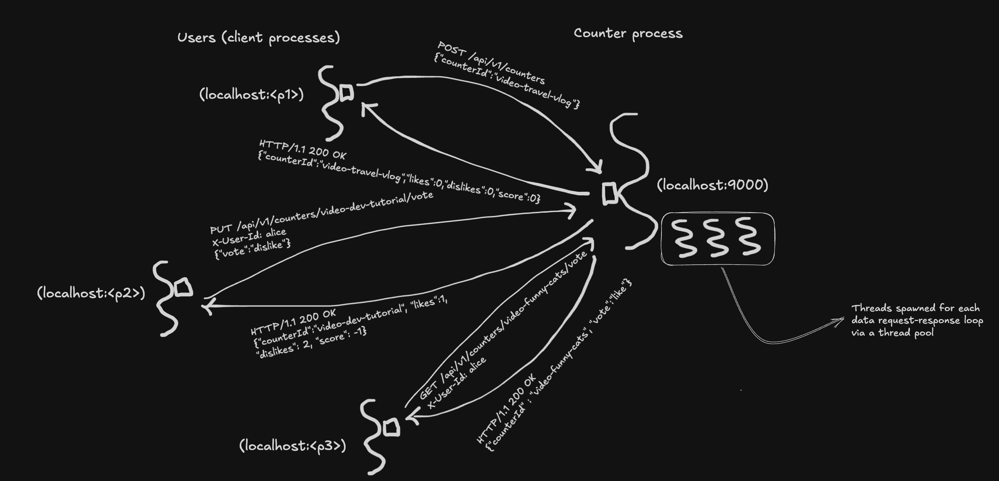

# Challenge 4 — HTTP

## Problem

Challenge 3 had multiple clients talking to one server, but only through a *custom* wire protocol we invented (newline-terminated text, with a blank line between responses). That works, but it means every client has to be our `Client.java` — you can't reach the server from a browser, from Python, from curl, from an iPhone, from a third-party service. The protocol is in our heads, not in the world.

Challenge 4 replaces our homegrown protocol with **HTTP** — the same protocol browsers and APIs everywhere already speak. Same underlying data, same concurrency model, same server shape. The wire is just now industry-standard instead of bespoke.


## Product

The server now speaks HTTP. You can drive it from:

- **curl** — every command is a one-liner from the terminal.
- **A browser** — visit `http://localhost:8080/` and click buttons (minimal frontend included).
- **Any programming language** — they all have HTTP clients.
- **Postman / Insomnia / any HTTP tool** — point it at `http://localhost:8080/api/v1/counters`.

No more `Client.java`. "The client" is anything that speaks HTTP.

### REST API

Same commands as challenge 3, now mapped to HTTP verbs + paths + JSON bodies:

| Challenge 3 command | HTTP request |
|---------------------|--------------|
| `create <id>` | `POST /api/v1/counters`  body: `{"counterId":"<id>"}` |
| `delete <id>` | `DELETE /api/v1/counters/<id>` |
| `list` | `GET /api/v1/counters` |
| `s <id>` | `GET /api/v1/counters/<id>` |
| `l <user> <id>` | `PUT /api/v1/counters/<id>/vote`  header: `X-User-Id: <user>`  body: `{"vote":"like"}` |
| `d <user> <id>` | `PUT /api/v1/counters/<id>/vote`  header: `X-User-Id: <user>`  body: `{"vote":"dislike"}` |
| `c <user> <id>` | `DELETE /api/v1/counters/<id>/vote`  header: `X-User-Id: <user>` |
| `myvote <user> <id>` | `GET /api/v1/counters/<id>/vote`  header: `X-User-Id: <user>` |

Three things worth calling out:

1. **User identity moves to an HTTP header.** Challenge 3 had `user-id` as a command argument (`l alice video-x`). HTTP puts that kind of ambient context into headers — `X-User-Id: alice`. Every vote/clear/myvote request carries it. In a real system, this would be a cookie or a bearer token after authentication; we're not doing real auth, but we're getting the *shape* right.
2. **Verbs do the work that command names used to do.** `PUT` means "replace" (cast or change a vote), `DELETE` means "remove" (clear a vote), `GET` means "read," `POST` means "create." The URL *identifies* what's being acted on; the verb says *what* the action is. This is what makes an API "RESTful."
3. **Errors use HTTP status codes instead of error strings.** `404 Not Found` replaces `no such counter 'X'`; `409 Conflict` replaces `counter 'X' already exists`; `400 Bad Request` replaces `X-User-Id header is required`. Clients distinguish success from failure by checking the status, not by parsing message text.

The system ships with three seeded counters — `video-funny-cats` and `video-dev-tutorial` already have votes from `alice` and `bob`, just like challenges 2 and 3.


## Programming

Same thinking order: **runtime first** (data, process, infra), then compile-time (models, libraries).

### Run-time — What's Actually Happening



#### Data

The wire upgrades from our custom text protocol to HTTP. What's on the wire now for a vote request:

```
PUT /api/v1/counters/video-funny-cats/vote HTTP/1.1
Host: localhost:8080
Content-Type: application/json
X-User-Id: alice
Content-Length: 16

{"vote":"like"}
```

And the response:

```
HTTP/1.1 200 OK
Content-Type: application/json
Content-Length: 71

{"counterId":"video-funny-cats","likes":3,"dislikes":0,"score":3}
```

Both request and response have the same shape:

- **A start line** — the request line (`PUT /... HTTP/1.1`) or the status line (`HTTP/1.1 200 OK`).
- **Headers** — key-value pairs: content type, content length, user identity, etc.
- **A blank line** — separates headers from body (same role our blank-line framing played in challenge 3).
- **A body** — JSON in our case, but HTTP doesn't mandate any format.

A few things worth noticing about this wire format compared to challenge 3:

- **Framing is baked in.** `Content-Length` tells the receiver exactly how many bytes the body is. No ambiguity about where a message ends. Challenge 3 invented newline-plus-blank-line as a substitute; HTTP has a proper mechanism.
- **Status codes are first-class.** `200`, `404`, `409`, `400` are the "ack" layer from challenge 3's optional exercise — but standardized, machine-readable, and understood by every HTTP client without configuration.
- **JSON replaces ad-hoc text.** Responses like `video-funny-cats -> likes: 3, dislikes: 0, score: 3` become `{"counterId":"video-funny-cats","likes":3,"dislikes":0,"score":3}` — structured data any language can parse without regexes.
- **Identity is a header, not a command argument.** `X-User-Id: alice` on every relevant request, separate from the URL and body.

Commands that used to be tokens (`l`, `d`, `c`) are now spread across three slots on the wire: the **verb** (`PUT`, `DELETE`), the **path** (which identifies the resource), and the **body** (which carries request-specific data). That's not more verbose accidentally — HTTP is trying to put each piece of information where it naturally belongs.

#### Process

At the process level, the server process still does what it's done all along: accept connections, handle requests, write responses, repeat. The **only** thing that changed is who manages the accept loop and how requests get parsed.

In challenge 3, we wrote this ourselves:

```java
while (true) {
    Socket client = serverSocket.accept();
    new Thread(() -> handleClient(client, helper)).start();
}
```

In challenge 4, Dropwizard does it for us. It bundles:

- **Jetty** — an HTTP server library that opens the listening socket, runs the `accept()` loop, spawns worker threads from a pool (bounded, unlike our `new Thread().start()`), parses HTTP messages, and handles the `Content-Length` framing.
- **Jersey** — a framework library that maps HTTP verbs + paths to Java methods via annotations (`@GET`, `@POST`, `@PUT`, `@DELETE`, `@Path`).
- **Jackson** — a JSON (de)serializer library that turns `{"vote":"like"}` into a `VoteRequest` object for us, and turns our `CounterResponse` object into `{"counterId":...}` on the way back.

Dropwizard ties these together so we only write the parts specific to our application: the resource class (`CounterResource`) with `@GET`/`@POST`/etc. methods, and the configuration file (`config.yml`) that tells it what port to listen on.

The thread-per-request model from challenge 3 is still in effect — but now it's **bounded** (Jetty's pool has a fixed size by default) and managed, so 10,000 concurrent clients don't translate to 10,000 threads. That's the fix we promised in challenge 3's "What's Missing" section.

Our `CounterHelper`'s per-counter locks still do the same job they did in challenge 3, because the concurrency problem is the same: multiple threads on the server process, touching shared state, racing through read-modify-write sequences. The locks don't care whether the threads were spawned by us with `new Thread()` or by Jetty from its pool — they just serialize operations on the same counter model.

#### Infrastructure

```
                 ┌─────────────────────────────────────────────────────────┐
                 │                  Your Machine + OS                      │
                 │                                                         │
                 │  ┌──────────────┐                                       │
                 │  │   Browser    │             ┌──────────────────────┐  │
                 │  │  localhost:  │ ◄──HTTP────►  localhost:8080       │  │
                 │  │    <p1>      │              │                     │  │
                 │  └──────────────┘              │   Dropwizard app    │  │
                 │                                │   (Jetty + Jersey   │  │
                 │  ┌──────────────┐              │    + Jackson)       │  │
                 │  │     curl     │              │                     │  │
                 │  │  localhost:  │ ◄──HTTP────► │  ┌───────────────┐  │  │
                 │  │    <p2>      │              │  │  thread pool  │  │  │
                 │  └──────────────┘              │  └───────────────┘  │  │
                 │                                │                     │  │
                 │  ┌──────────────┐              │  Shared models:     │  │
                 │  │  Postman /   │              │    CounterStore     │  │
                 │  │  Python /    │ ◄──HTTP────► │    UserVoteStore    │  │
                 │  │  anything    │              │                     │  │
                 │  │              │              │                     │  │
                 │  └──────────────┘              └──────────────────────┘  │
                 │                                                         │
                 └─────────────────────────────────────────────────────────┘
```

Same basic picture as challenge 3 — one server process, multiple client processes, TCP connections between them. What's new:

- **Port 8080** is Dropwizard's convention (we could pick anything; 8080 is customary for HTTP).
- **HTTP is the wire protocol** sitting on top of TCP. Conceptually: TCP is still the pipe that carries bytes; HTTP defines how to structure those bytes into requests and responses. Your browser, curl, Python's `requests` library, and Go's `net/http` package all speak this structure natively, so they all interoperate without writing any custom client code.
- **An admin port** (8081) is exposed by Dropwizard for health checks and metrics. Visit `http://localhost:8081/healthcheck` and you get JSON about whether the app is healthy. This is the observability foothold that Phase 2 will grow.


### Compile-Time — How to Implement It

Challenge 4 keeps all four models and both libraries from challenge 3, adds a few DTO models for JSON, and replaces `Server.java` and `Client.java` with Dropwizard's `Application` + `Resource` pair.

#### Models — unchanged from challenge 3

- `Counter` — aggregate state (`counterId`, `likes`, `dislikes`).
- `UserVote` — one user's vote (`counterId`, `userId`, `vote` — `LIKE` or `DISLIKE`).
- `CounterStore` — collection of counters, still `ConcurrentHashMap`-backed.
- `UserVoteStore` — collection of user votes, same.

#### Models — new (DTOs for JSON)

Three new tiny models that exist to *shape the wire format*. They're not stored — they're just JSON-friendly snapshots constructed per-request.

- **`CounterResponse`** — what `GET /counters/{id}` and friends return. Fields: `counterId`, `likes`, `dislikes`, `score`. Built from a `Counter` with a static `.from(c)` factory.
- **`VoteRequest`** — what `PUT /counters/{id}/vote` accepts. Field: `vote` (a string `"like"` or `"dislike"`). Has a `.toVote()` helper that parses the string into our `UserVote.Vote` enum, throwing on invalid input.
- **`MyVoteResponse`** — what `GET /counters/{id}/vote` returns. Fields: `userId`, `counterId`, `vote` (string or null).
- **`CreateCounterRequest`** — what `POST /counters` accepts. Field: `counterId`.

Why separate DTOs from the internal `Counter` / `UserVote` models?

Today, they happen to mirror the internal models exactly — serializing `Counter` directly with Jackson would produce the same JSON we're building by hand. The split is pre-emptive: it earns its keep in later challenges where the wire shape and the stored shape diverge.

- **Challenge 6 (caching):** cache entries may include TTL / freshness metadata the stored model doesn't have.
- **Challenge 12 (read replicas):** responses may carry "possibly stale" markers the stored data doesn't.
- **Challenges 14–15 (task queues / event streams):** event payloads carry routing metadata (trace IDs, retry counts) that aren't part of any model.

For this challenge alone, you could get away with returning `Counter` directly. We're establishing the DTO pattern now so future divergence doesn't require a painful refactor.

#### The library: `CounterHelper` — refactored

Same role as challenge 3, but the interface changed: instead of `handle(String line)` parsing text commands and returning text responses, the helper now exposes **typed methods** that return typed results.

```java
public boolean create(String counterId);
public boolean delete(String counterId);
public Optional<Counter> vote(String userId, String counterId, UserVote.Vote v);
public Optional<Counter> clearVote(String userId, String counterId);
public Optional<Counter> get(String counterId);
public Optional<Optional<UserVote.Vote>> getMyVote(String userId, String counterId);
public List<Counter> list();
```

Two things worth noticing:

1. **No more string parsing in the helper.** That was a command-line-protocol concern. Now the resource class parses HTTP (which Dropwizard does for us) and calls typed methods with already-structured data. The helper is free to be what it really is: a library that coordinates counter and vote operations with correct concurrency.
2. **Errors are signalled with `Optional` / `boolean`, not exceptions.** The helper stays process-agnostic and framework-agnostic — it doesn't know anything about HTTP. The resource class is responsible for translating "missing counter" (empty Optional) into `404 Not Found`, "already exists" (false return) into `409 Conflict`, etc. Keeps the helper usable in other contexts (a CLI tool, a background job, a different protocol) without changing a line.

The per-counter lock map (from challenge 3's Deep Dive) is unchanged — **every counter-scoped method acquires the lock for that counter ID**, including reads (`get`, `getMyVote`). Reads take the lock too because a writer's read-modify-write has a brief window where `UserVoteStore` has the new vote but `Counter.likes`/`dislikes` haven't been updated yet; an unlocked read could land in that window and see inconsistent state (e.g., a user's vote that the aggregate doesn't reflect). Holding the lock for reads guarantees the reader sees either "before the write" or "after the write," never "in the middle." The one exception is `list()` — cross-counter snapshots would require holding every lock at once, so it deliberately skips locking (same rationale as challenge 3).

#### The library: `CounterApplication` — new (replaces `Server.java`)

A Dropwizard `Application` subclass. Its job is to bootstrap the server:

```java
public class CounterApplication extends Application<CounterConfiguration> {
    public static void main(String[] args) throws Exception { new CounterApplication().run(args); }

    @Override
    public void initialize(Bootstrap<CounterConfiguration> bootstrap) {
        bootstrap.addBundle(new AssetsBundle("/assets", "/", "index.html"));
    }

    @Override
    public void run(CounterConfiguration configuration, Environment environment) {
        // Create stores + helper, seed data, register the resource.
        // ...
        environment.jersey().register(new CounterResource(helper));
        environment.healthChecks().register("basic", new BasicHealthCheck());
    }
}
```

Two phases:

- **`initialize`** runs before the server starts. It wires up the assets bundle so the HTML frontend is served at `/`.
- **`run`** runs at startup. It creates the stores, seeds them, and registers the REST resource class + health check.

Notice what `CounterApplication` *doesn't* do: no `ServerSocket`, no `accept()` loop, no thread creation, no HTTP parsing. All of that is inside Dropwizard (Jetty + Jersey), hidden behind this pair of methods.

#### The library: `CounterResource` — new (replaces `handleClient` logic)

The class that declares the HTTP endpoints. Each method has annotations that tell Jersey which verb + path + inputs it handles:

```java
@Path("/v1/counters")
@Produces(MediaType.APPLICATION_JSON)
public class CounterResource {

    @GET
    public List<CounterResponse> list() { ... }

    @POST
    @Consumes(MediaType.APPLICATION_JSON)
    public Response create(CreateCounterRequest req) { ... }

    @DELETE
    @Path("/{id}")
    public Response delete(@PathParam("id") String id) { ... }

    @GET @Path("/{id}")
    public CounterResponse get(@PathParam("id") String id) { ... }

    @PUT @Path("/{id}/vote")
    @Consumes(MediaType.APPLICATION_JSON)
    public CounterResponse vote(@PathParam("id") String id,
                                @HeaderParam("X-User-Id") String user,
                                VoteRequest req) { ... }

    @DELETE @Path("/{id}/vote")
    public CounterResponse clearVote(@PathParam("id") String id,
                                     @HeaderParam("X-User-Id") String user) { ... }

    @GET @Path("/{id}/vote")
    public MyVoteResponse myVote(@PathParam("id") String id,
                                 @HeaderParam("X-User-Id") String user) { ... }
}
```

What each method body does: validate inputs, call the helper, translate helper's result (`Optional`, `boolean`) into an HTTP response. That's it. The resource class is a thin translation layer between HTTP data request and the helper library's Java interface.

Two things worth noticing:

1. **Annotations do the routing.** There's no switch statement, no regex, no custom parsing. Jersey sees `@PUT @Path("/{id}/vote")` and makes sure any `PUT /api/v1/counters/<anything>/vote` request reaches this method with `id` set appropriately. All the HTTP-layer mechanics are declarative.
2. **DTO conversion is automatic.** The `@Consumes(APPLICATION_JSON)` on `vote` tells Jersey to ask Jackson to deserialize the request body into a `VoteRequest` object. The return type `CounterResponse` gets serialized by Jackson on the way out. We write zero JSON-handling code.

#### The model: `CounterConfiguration`

A class whose only job is to hold configuration values — things like port numbers, feature flags, or external URLs. Empty for now (Dropwizard's built-in `Configuration` gives us everything we currently need, like the port settings in `config.yml`), but ready to be populated when we add custom config. It's a model in the strict sense: pure state, no behavior, portable — `config.yml` itself is *literally* this model serialized to YAML.

#### The library: `BasicHealthCheck`

A tiny library whose job is to answer one question: "is this server process healthy?" Today it always returns healthy; in real systems it would check that dependencies are reachable (database, cache, downstream services) and fail if any are broken. Dropwizard registers it and exposes it at `http://localhost:8081/healthcheck`, so load balancers, orchestration systems (Kubernetes, ECS), and humans can all poll it to decide whether to route traffic to this instance.

It's a library, not a model: it *does* work (runs checks, returns a result) and can't be serialized — it's code, not data.


## Run It

Build with Maven, run with Java.

```bash
cd challenge-4-counter-server-process
mvn clean package
java -jar target/challenge-4-counter-1.0-SNAPSHOT.jar server config.yml
```

You'll see Dropwizard's startup log, ending with something like:

```
INFO  org.eclipse.jetty.server.Server: Started ...
INFO  o.e.jetty.server.AbstractConnector: Started application@... {HTTP/1.1, (http/1.1)}{0.0.0.0:8080}
INFO  o.e.jetty.server.AbstractConnector: Started admin@... {HTTP/1.1, (http/1.1)}{0.0.0.0:8081}
```

Two ports:
- **8080** — the app (REST API + frontend).
- **8081** — the admin port (health checks, metrics).

### Try it with curl

Open another terminal and send requests:

```bash
# List all counters (no auth needed)
curl http://localhost:8080/api/v1/counters

# Get one counter
curl http://localhost:8080/api/v1/counters/video-funny-cats

# Check alice's vote on video-funny-cats (she has a seeded LIKE)
curl -H "X-User-Id: alice" http://localhost:8080/api/v1/counters/video-funny-cats/vote

# Charlie likes the cats video
curl -X PUT \
  -H "X-User-Id: charlie" \
  -H "Content-Type: application/json" \
  -d '{"vote":"like"}' \
  http://localhost:8080/api/v1/counters/video-funny-cats/vote

# Create a new counter
curl -X POST \
  -H "Content-Type: application/json" \
  -d '{"counterId":"video-cooking"}' \
  http://localhost:8080/api/v1/counters

# Clear alice's vote
curl -X DELETE \
  -H "X-User-Id: alice" \
  http://localhost:8080/api/v1/counters/video-funny-cats/vote

# Delete a counter
curl -X DELETE http://localhost:8080/api/v1/counters/video-music-mix

# Try something that errors (no such counter)
curl -i http://localhost:8080/api/v1/counters/video-ghost
# ↑ returns 404 with JSON body explaining the error
```

### Try it in a browser

Open `http://localhost:8080/` in a browser. You'll see a minimal black-and-white page with an input for your user ID, a button to create counters, and a table listing all counters with like/dislike/clear/delete actions per row.

Type `alice` in the user field, press Tab, and you'll see alice's existing votes reflected in the "your vote" column. Try liking a counter from one browser tab, then opening the same page in a second browser (or incognito window), setting a different user ID, and watching the aggregates update. That's the same concurrent-clients story from challenge 3, now reachable without writing a custom client.

### Check the admin endpoints

```bash
curl http://localhost:8081/healthcheck
# Returns JSON with the status of every registered health check.

curl http://localhost:8081/metrics
# Returns Dropwizard's metrics — request counts, latency histograms, thread pool stats, JVM stats.
```

Metrics fall out of Dropwizard for free. Phase 2 (observability) will lean on this.


## What's Missing

- **Persistence** — restart the server process, all counter models and vote models disappear. Challenge 5 adds SQLite. This is the biggest remaining gap.
- **Authentication** — `X-User-Id: whoever` is trusted without verification. Real systems use bearer tokens, cookies, or mutual TLS.
- **HTTPS** — we're on plain HTTP. In production, everything goes through TLS. Dropwizard supports it via a config change; we're skipping it for simplicity.
- **Rate limiting** — any client can spam unlimited requests. Real systems enforce per-user / per-IP limits.
- **Multiple server instances + load balancer** — one server is a single point of failure and a single performance bottleneck. That's challenge 9, where we'll immediately discover that in-process state can't be shared across instances.
- **Real-time updates** — the frontend process polls on user action. A real social site would push updates via WebSockets or Server-Sent Events so everyone sees counts move in real time.


## Notes

A few things worth noticing about this design:

- **HTTP is just TCP + structure.** The byte stream underneath hasn't changed since challenge 3 — same socket, same `accept()` loop, same thread-per-connection model. HTTP is a convention layered on top: a specific format for writing requests and responses into bytes, understood by every HTTP client in the world. "It's just TCP, with rules about what the bytes mean."
- **The framework earns its keep.** Dropwizard brings HTTP parsing, JSON serialization, thread pool management, health checks, metrics, admin endpoints, and config file parsing — all for the price of extending two classes and adding some annotations. Writing any of these by hand (on top of challenge 3's `ServerSocket`) would take far more code than the whole challenge 3 implementation. This is what a framework *is*: a bundle of solved problems, offered in exchange for adopting its conventions.
- **Coupling the resource class to Dropwizard is fine; coupling the helper to it is not.** The `CounterResource` class is soaked in `jakarta.ws.rs` annotations — that's its job. But the `CounterHelper` has zero framework imports. That boundary matters: if we ever wanted to expose the helper over gRPC, or call it from a batch script, or unit-test it without spinning up an HTTP server, nothing about the helper's interface would change. The framework lives at the edge.
- **Bounded concurrency came along for the ride.** Challenge 3 had unbounded `new Thread().start()`. Jetty uses a bounded thread pool under the hood — configurable via `config.yml` (default is around 200 threads). So "HTTP" and "thread pool" arrived together, not by design but because they're bundled together in how modern HTTP servers work. The lesson from challenge 3 ("real servers use bounded pools") is now implicitly demonstrated.
- **The separation we built in earlier challenges paid off here.** Models unchanged. Helper's interface refactored once, trivially. Everything that was HTTP-specific (routing, JSON, status codes) lives in `CounterResource` — a single file that could be swapped for a gRPC resource, a CLI controller, or anything else, without touching the rest of the code. That's the payoff from keeping the model/library split clean from challenge 0.
