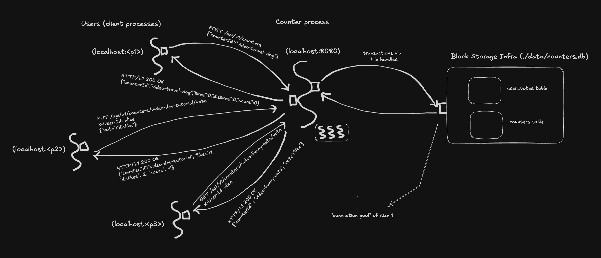

# Challenge 5 — SQLite Persistence

## Problem

Through challenge 4, every counter and vote lived in `ConcurrentHashMap`s inside the JVM's heap. Restart the server → all counters disappear → the seeded data comes back, but every vote anyone cast since startup is gone.

That's not how real systems work. Restarts happen — for deploys, for crashes, for power cuts, for migrations. The data has to outlive the process.

Challenge 5 is about that single concept: **persistence**. The state moves out of the JVM's heap and onto disk, so it survives restarts.


## Product

The HTTP API is *unchanged*. Same verbs, same paths, same JSON shapes, same status codes. From a client process's perspective, nothing about challenge 5 looks different from challenge 4.

What changed:

- Counters models and vote models now live in a SQLite database file at `./data/counters.db` (created automatically on first run).
- Restart the server, all data persists. Stop it, copy the file, take it home, restore it later — it's just a file.
- Seeding only happens on the first run (when the DB is empty). Subsequent restarts leave the data alone.

The frontend (`http://localhost:8080/`) and the REST API (`http://localhost:8080/api/v1/counters`) work exactly like challenge 4 did.


## Programming

Same thinking order: **runtime first** (data, process, infra), then compile-time (models, libraries).

One new concept this challenge introduces:

- **Persistence** — data lives on disk in a SQL database (SQLite), not in the JVM's heap. This means:
  - State survives process restarts.
  - Concurrency control moves from application-level locks (challenge 3's lock map, still implicit in challenge 4) to **database transactions**.
  - Reads and writes become disk operations instead of memory operations — ~100x slower per call but well within "fast enough" for our scale.

### Run-time — What's Actually Happening



#### Data

The wire format is identical to challenge 4 — same JSON, same status codes. What changed is *where the data lives*, which is managed by the server process:

- **Challenge 4**: `ConcurrentHashMap<String, Counter>` in JVM heap → process dies → maps gone → data gone.
- **Challenge 5**: SQLite tables in a file on disk → process dies → file persists → data still there next time.

The schema:

```sql
CREATE TABLE counters (
    counter_id TEXT PRIMARY KEY,
    likes      INTEGER NOT NULL DEFAULT 0,
    dislikes   INTEGER NOT NULL DEFAULT 0
);

CREATE TABLE user_votes (
    counter_id TEXT NOT NULL,
    user_id    TEXT NOT NULL,
    vote       INTEGER NOT NULL CHECK (vote IN (-1, 1)),   -- 1 = LIKE, -1 = DISLIKE
    PRIMARY KEY (counter_id, user_id)
);

CREATE INDEX idx_user_votes_counter_id ON user_votes(counter_id);
```

Two tables, mirroring the two stores from challenges 2–4. The composite primary key on `user_votes` is the SQL version of "one user can have at most one vote per counter." Challenge 4 enforced this by keying a `HashMap` on `counterId::userId` — so the enforcement was done by the data structure we chose. Challenge 5 enforces it as a **schema constraint the DB engine upholds for any writer** — our Java code, the `sqlite3` CLI, or any other client that opens this DB file all see the same rule. The uniqueness guarantee moves from "a property of our application code" to "a property of the data itself."

#### Process

The HTTP-handling pipeline is unchanged from challenge 4. Dropwizard accepts requests, dispatches them to `CounterResource` methods, and our resource calls into `CounterHelper` exactly as before.

What changed: the helper used to talk to in-memory data structures (`CounterStore`, `UserVoteStore`). Now it talks to the database via JDBI. Each call that used to be a `Map.put` or `Map.get` is now a SQL statement (`INSERT`, `SELECT`, `UPDATE`).

The big architectural shift: **concurrency control moved from the application to the database**.

- **Challenge 3** had per-counter locks in `CounterHelper`. Two concurrent votes on the same counter serialized via `synchronized(lockFor(counterId))`.
- **Challenge 4** kept those same locks (Dropwizard's thread pool only made it more important — same problem, more threads).
- **Challenge 5** drops the lock map entirely. SQLite's transactions provide the same atomicity guarantee at the storage layer. Two concurrent `vote()` calls on the same counter model open transactions; SQLite serializes the writer threads.

So our helper code looks like:

```java
public Optional<Counter> vote(String userId, String counterId, UserVote.Vote v) {
    return jdbi.inTransaction(h -> {
        // (1) Check counter exists, (2) upsert vote, (3) recompute aggregates,
        //     (4) read back updated counter — all atomic via the transaction.
        ...
    });
}
```

`jdbi.inTransaction` opens a SQL transaction, runs the lambda, commits on return, rolls back on exception. The four steps inside the transaction either all happen or none happen — the same all-or-nothing property our locks gave us, now provided by the DB.

##### Why we limit the connection pool to 1

SQLite is fundamentally a **single-writer** database. With WAL (Write-Ahead Logging) mode, you can have many concurrent readers, but only one writer at a time. If multiple connections try to write simultaneously, the loser gets a `SQLITE_BUSY` error.

Dropwizard's connection pool defaults to many connections. For SQLite, that's a recipe for `SQLITE_BUSY` errors under any concurrent write load. We work around this by limiting the pool to **1 connection** in `config.yml`:

```yaml
database:
  maxSize: 1
  minSize: 1
  initialSize: 1
```

All requests now serialize through one connection — no contention for the writer lock, no errors. Effectively, we pay a bit of read-parallelism for write reliability. This is a SQLite-specific compromise; in challenge 10 we'll move to Postgres where many concurrent writers are first-class and a normal-sized connection pool works.

#### Infrastructure

```
              ┌──────────────────────────────────────────────────────────────┐
              │                       Your Machine + OS                      │
              │                                                              │
              │  ┌──────────┐                                                │
              │  │ Browser  │       ┌──────────────────────────────────┐     │
              │  │  / curl  │ ◄──HTTP──►  localhost:8080               │     │
              │  └──────────┘       │                                  │     │
              │                     │   Counter Server Process          │     │
              │                     │   (Dropwizard + Jetty + JDBI)    │     │
              │                     │                                  │     │
              │                     │   ┌──────────────────────────┐   │     │
              │                     │   │ Single connection pool   │   │     │
              │                     │   │ (max 1 connection)       │   │     │
              │                     │   └────────────┬─────────────┘   │     │
              │                     └────────────────┼─────────────────┘     │
              │                                      │                       │
              │                                      ▼                       │
              │                            ┌────────────────────┐            │
              │                            │  ./data/           │            │
              │                            │    counters.db     │  ← SQLite  │
              │                            │    counters.db-wal │     files  │
              │                            │    counters.db-shm │            │
              │                            └────────────────────┘            │
              │                                                              │
              └──────────────────────────────────────────────────────────────┘
```

Two new infrastructure pieces this challenge introduces:

- **The SQLite database files** live on the same machine as the server, on local disk. Three files:
  - `counters.db` — the main database file (tables, indexes, data).
  - `counters.db-wal` — the write-ahead log (recent writes, periodically merged into the main file).
  - `counters.db-shm` — shared memory for coordinating across processes (mostly unused for us since we have only one server process).
- **The connection pool** sits between the application code and the JDBC driver. For SQLite we configured it to size 1 (see above); in challenge 10 with Postgres we'd use a much bigger pool (10–100 connections).

The DB is *embedded* — it runs inside the same JVM as the application, no separate process. That's a SQLite property; it makes deployment simpler (one JAR + one file) at the cost of not being able to share the data with other server processes. Challenge 10 separates the DB into its own process.


### Compile-Time — How to Implement It

Two new categories of files appear: **DB entities** (one record per table) and **DAOs** (one per table). The internal models (`Counter`, `UserVote`) and HTTP DTOs are unchanged from challenge 4.

#### Models — deleted

- **`CounterStore`** and **`UserVoteStore`** from challenges 2–4 are **gone**. Each one was a model that bundled data (a `Map` of counters or votes) with access methods (`get`, `has`, `add`, `remove`). Persistence splits that single responsibility into two separate things:
  - The **data** moves to a SQL table on disk (infra) — the `counters` table replaces `CounterStore`'s `Map`, the `user_votes` table replaces `UserVoteStore`'s `Map`.
  - The **access methods** become a DAO (library) — `CountersDAO` replaces `CounterStore`'s `get`/`has`/`add`/`remove`, `UserVotesDAO` replaces `UserVoteStore`'s.

This is the pattern: an in-memory store model *dissolves* into "infra that holds data" + "library that provides access." The concept of "the collection of counters" still exists — it's just no longer a single Java object. It's a table + a DAO, each doing half of what the store used to do.

#### Models — unchanged

- `Counter` — internal domain model, `(counterId, likes, dislikes)`.
- `UserVote` — internal domain model, `(counterId, userId, vote)` with `Vote` enum (`LIKE`, `DISLIKE`).
- `CounterResponse`, `VoteRequest`, `MyVoteResponse`, `CreateCounterRequest` — HTTP DTOs, all unchanged.

The key thing: **all of these are still pure data classes with no DB knowledge**. The HTTP layer doesn't know about SQL; the DB layer doesn't know about JSON. Both ends meet at the helper library.

#### Models — new (one record per table row)

- **`CounterEntity`** (record) — one row of the `counters` table: `(counterId, likes, dislikes)`. Same shape as the `Counter` model.
- **`UserVoteEntity`** (record) — one row of the `user_votes` table: `(counterId, userId, vote)` where `vote` is an integer (1 or -1).

Why separate entity classes from the domain models?

Same logic as the DTO-vs-model split from challenge 4. The DB representation can diverge from the in-memory representation — `vote` becomes an `int` (-1/1) instead of an enum, columns might get renamed, computed columns might appear. Keeping them separate means schema changes don't ripple into business logic.

For now they happen to mirror each other almost exactly. The split earns its keep when divergence happens (it will).

#### The library: `CountersDAO`

A **Data Access Object** — a library whose only job is to translate between SQL rows and Java objects. JDBI generates the implementation for us from annotated method declarations:

```java
@RegisterConstructorMapper(CounterEntity.class)
public interface CountersDAO {

    @SqlUpdate("INSERT INTO counters(counter_id, likes, dislikes) VALUES (:counterId, 0, 0)")
    void insert(String counterId);

    @SqlQuery("SELECT counter_id AS counterId, likes, dislikes FROM counters WHERE counter_id = :counterId")
    Optional<CounterEntity> get(String counterId);

    @SqlUpdate("DELETE FROM counters WHERE counter_id = :counterId")
    int delete(String counterId);

    @SqlQuery("SELECT counter_id AS counterId, likes, dislikes FROM counters")
    List<CounterEntity> listAll();

    @SqlUpdate("""
            UPDATE counters
               SET likes    = (SELECT COUNT(*) FROM user_votes WHERE counter_id = :counterId AND vote =  1),
                   dislikes = (SELECT COUNT(*) FROM user_votes WHERE counter_id = :counterId AND vote = -1)
             WHERE counter_id = :counterId
            """)
    int recomputeAggregates(String counterId);
}
```

Three things worth noticing:

1. **It's an interface, not a class.** JDBI inspects the annotations and generates the implementation at runtime. We don't write any SQL execution code — JDBI prepares statements, binds parameters, executes, and maps results.
2. **The recompute logic is now SQL.** Challenge 4's `recomputeAggregates(c)` iterated `UserVoteStore` in Java. Here it's `UPDATE ... SET likes = (SELECT COUNT(*) FROM user_votes WHERE ...)` — same logic, expressed in SQL, executed inside the DB. No round-trip to the application.
3. **`@RegisterConstructorMapper(CounterEntity.class)`** tells JDBI: "when you see results from a query that returns this type, construct it via its constructor, matching column names to constructor parameters." That's why our `SELECT counter_id AS counterId` aliases the column to match the record field name.

#### The library: `UserVotesDAO`

Same shape — one method per SQL statement, JDBI generates the implementation:

```java
public interface UserVotesDAO {

    @SqlUpdate("""
            INSERT INTO user_votes(counter_id, user_id, vote)
            VALUES (:counterId, :userId, :vote)
            ON CONFLICT(counter_id, user_id) DO UPDATE SET vote = excluded.vote
            """)
    int upsert(String counterId, String userId, int vote);

    @SqlQuery("SELECT vote FROM user_votes WHERE counter_id = :counterId AND user_id = :userId")
    OptionalInt getVote(String counterId, String userId);

    @SqlUpdate("DELETE FROM user_votes WHERE counter_id = :counterId AND user_id = :userId")
    int delete(String counterId, String userId);

    @SqlUpdate("DELETE FROM user_votes WHERE counter_id = :counterId")
    int deleteByCounter(String counterId);
}
```

Notice:

- **`upsert` uses SQLite's `ON CONFLICT ... DO UPDATE`** — atomic insert-or-replace, no explicit "does this row exist?" check.
- **`deleteByCounter`** is the cascade we use when deleting a counter — wipe all its user votes in one statement. This replaces the in-memory `removeByCounter` from earlier challenges.

#### The library: `CounterHelper` (refactored)

The helper's *interface* is unchanged from challenge 4 — same typed methods returning `Optional` / `boolean`. The implementation changed:

```java
public class CounterHelper {

    private final Jdbi jdbi;

    public CounterHelper(Jdbi jdbi) {
        this.jdbi = jdbi;
    }

    public Optional<Counter> vote(String userId, String counterId, UserVote.Vote v) {
        return jdbi.inTransaction(h -> {
            CountersDAO dao = h.attach(CountersDAO.class);
            if (!dao.has(counterId)) return Optional.<Counter>empty();
            h.attach(UserVotesDAO.class).upsert(counterId, userId, voteToInt(v));
            dao.recomputeAggregates(counterId);
            return dao.get(counterId).map(this::toModel);
        });
    }

    // ... similar for create, delete, clearVote, get, getMyVote, list
}
```

Three things worth noticing:

1. **The lock map is gone.** Compare to challenge 3's `synchronized(lockFor(counterId))` — that whole machinery was replaced by `jdbi.inTransaction(...)`. The atomicity guarantee is now the database's responsibility, not ours.
2. **The interface didn't change.** The resource class still calls `helper.vote(user, counter, v)` and gets back an `Optional<Counter>`. From the resource's perspective, nothing about the helper looks different. That's the payoff for keeping the interface clean: the storage swap is an internal refactor, not an architectural change.
3. **The translation between `UserVote.Vote` (enum) and integer (DB column) lives in the helper.** `voteToInt` and `intToVote` are private helpers. The DAO speaks ints; the rest of the application speaks enum. The helper bridges.

#### The library: `CounterApplication` (updated)

A small expansion over challenge 4. Now also:

1. Builds a JDBI instance from the configured `DataSourceFactory`.
2. Runs schema setup (`CREATE TABLE IF NOT EXISTS ...`, PRAGMAs for WAL mode + busy_timeout).
3. Seeds the DB on first run only (skips if the counters table is non-empty).
4. Registers a `DatabaseHealthCheck` that pings the DB with `SELECT 1`.

The schema-setup-in-app-startup pattern is the simplest possible thing. In real systems you'd use a migration tool (Flyway, Liquibase) to manage versioned schema changes — that's a future challenge in Phase 2.

#### The model: `CounterConfiguration` (extended)

Now holds a `DataSourceFactory` field, populated from the `database:` block in `config.yml`. It's still pure data — Dropwizard reads `config.yml`, builds the DataSourceFactory, and hands it to our app at startup.

#### The library: `DatabaseHealthCheck` (replaces `BasicHealthCheck`)

The health check now does meaningful work — it queries `SELECT 1` against the DB and only reports healthy if the query succeeds. If the DB file is missing, locked, or corrupted, the check fails. Load balancers and orchestration systems can then route around this instance.

This is the start of *real* observability: the answer to "is this server healthy?" now includes "are its dependencies healthy?"


## Run It

```bash
cd challenge-5-counter-server-process
mvn clean package
java -jar target/challenge-5-counter-1.0-SNAPSHOT.jar server config.yml
```

The first run creates `./data/counters.db` and seeds it with the three usual counters and four user votes. Subsequent runs leave the DB alone.

### Try the persistence

```bash
# Cast a vote
curl -X PUT \
  -H "X-User-Id: charlie" \
  -H "Content-Type: application/json" \
  -d '{"vote":"like"}' \
  http://localhost:8080/api/v1/counters/video-funny-cats/vote

# Kill the server (Ctrl-C in the terminal running it)

# Restart
java -jar target/challenge-5-counter-1.0-SNAPSHOT.jar server config.yml

# Confirm Charlie's vote is still there
curl -H "X-User-Id: charlie" http://localhost:8080/api/v1/counters/video-funny-cats/vote
# → {"userId":"charlie","counterId":"video-funny-cats","vote":"like"}
```

### Confirm transactions hold under concurrent load

```bash
# Fire 20 concurrent likes from different users on the same counter
for i in $(seq 1 20); do
  (curl -s -X PUT \
    -H "X-User-Id: stress$i" \
    -H "Content-Type: application/json" \
    -d '{"vote":"like"}' \
    http://localhost:8080/api/v1/counters/video-dev-tutorial/vote > /dev/null) &
done
wait

# Should show exactly 21 likes (1 seeded + 20 from stress) and 1 dislike
curl http://localhost:8080/api/v1/counters/video-dev-tutorial
```

If the count comes back exactly right, transactions are doing their job.

### Inspect the DB directly

SQLite gives you SQL on disk:

```bash
sqlite3 ./data/counters.db
sqlite> SELECT * FROM counters;
sqlite> SELECT * FROM user_votes;
sqlite> .schema
sqlite> .quit
```

This is one of the joys of moving to a real DB — your data is queryable outside the application. Good for debugging, ad-hoc reports, and verifying migrations.

### Reset the data

If you want to start fresh, just delete the files:

```bash
rm -f data/counters.db data/counters.db-wal data/counters.db-shm
```

Next startup will re-create the schema and re-seed.


## What's Missing

- **Schema migrations** — `CREATE TABLE IF NOT EXISTS` works for one-shot schema. The moment you need to *change* the schema (add a column, rename a table, alter a constraint), this approach falls over. Flyway / Liquibase handle versioned migrations.
- **Real concurrent writes** — SQLite serializes writers via a single connection. Postgres (challenge 10) supports many concurrent writers properly.
- **Backups + recovery** — the DB is one local file; if disk fails, data is gone. For SQLite specifically, you *could* get a crude backup by periodically copying `counters.db` somewhere safe (or using `sqlite3`'s built-in `.backup` command for a consistent snapshot). But that's not really what backups look like in production — real systems handle data loss through **replication** (the data lives on multiple machines at once, so a single disk failure doesn't matter) plus **point-in-time recovery** (the ability to rewind the DB to any moment in the past by replaying the write-ahead log). Challenge 12 (read replicas) is where the replication story starts.
- **Multiple server instances** — the DB lives inside the server process. Two instances would each have their own separate DB file with diverging state. Challenge 9 sets up multiple instances and exposes this; challenge 10 fixes it with a separate central DB.
- **Read scaling** — every read hits the same SQLite file (and now the same connection). Caching (challenge 6) reduces DB load; read replicas (challenge 12) scale read capacity.


## Notes

A few things worth noticing about this design:

- **The data moved; the contract didn't.** The HTTP API is byte-for-byte identical to challenge 4. A client written against challenge 4 works unchanged against challenge 5. That's the payoff for keeping the resource layer thin and the storage swap behind the helper's interface.
- **Concurrency control moved from application to database.** Challenge 3's lock map served us for a long time. Now it's gone — `jdbi.inTransaction` does the same job, enforced at the storage layer instead of in our Java code. This is a real architectural shift, not just code refactoring: in a multi-instance world (challenge 9+), application-level locks couldn't have worked anyway because each instance has its own JVM. DB-level transactions work across instances because there's one shared DB.
- **Data has a parallel existence outside the JVM.** Until challenge 4, "data" meant "Java objects in the JVM's heap." Now data exists as bytes on disk that the JVM happens to read into objects. You can browse it with `sqlite3`. You can copy it to another machine. You can restore it from a backup. The data's existence is no longer tied to the process's lifetime.
- **The DAO is a library, the entity is a model.** `CountersDAO` does work (executes SQL); `CounterEntity` holds data. Same model/library split we've been maintaining. The annotations on the DAO interface are JDBI's way of saying "this is an interface where each method is a tiny library function" — JDBI generates the implementing class.
- **SQLite is a deliberate-but-temporary choice.** It's the simplest possible "real database" — embedded, file-based, no server to run. That makes it perfect for teaching: you get ACID, transactions, SQL, and persistence without setting up Postgres or MySQL. The cost is single-writer scaling, which we'll feel in challenge 9 when we add multiple instances and discover that file-based DBs don't share well across processes. Challenge 10 swaps in Postgres, which fixes that — at the cost of being a separate process you have to deploy and manage.
- **The PRAGMAs matter.** `journal_mode=WAL` enables concurrent reads alongside one writer (huge improvement over SQLite's default rollback-journal mode). `busy_timeout=3000` tells the driver to retry for up to 3 seconds if the DB is locked. `synchronous=NORMAL` is a small durability/performance trade — slightly less safe than `FULL` but still durable across crashes (just maybe not across power loss with the latest microseconds of writes). These three lines turn SQLite db infra from "embedded toy" into "good enough for many real workloads."
