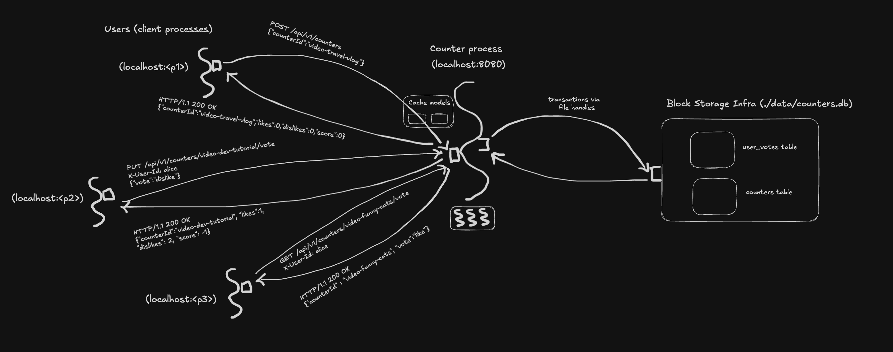

# Challenge 6 — Caching

## Problem

In challenge 5, every read hits the database. `GET /api/v1/counters/video-funny-cats` runs a SQL `SELECT` every single time, even if nobody has voted since the last call. For one user that's fine. For a popular video getting 10,000 reads per second, we're querying the same row 10,000 times for data that changes maybe once a second.

Challenge 6 fixes this by adding an **in-memory cache** between the application and the database. Hot data gets loaded from disk once, served from RAM many times, and refreshed when it goes stale.


## Product

Same HTTP API as challenge 5, same status codes, same JSON shapes. From a client's perspective, nothing looks different — except reads are faster.

The one behavioral change (important enough to call out): **reads can return slightly stale data** — up to a few seconds old. If Alice votes LIKE and Bob reads the counter 1 second later, Bob *might* see the old count (before Alice's vote) if the cache hasn't expired yet. After the TTL expires (5 seconds for counter aggregates, 3 for votes), the next read gets fresh data from the DB.

This is the fundamental trade-off of caching: **speed for freshness**. We're explicitly choosing "fast but possibly a few seconds stale" over "always fresh but always hitting the DB."


## Programming

Same thinking order: **runtime first** (data, process, infra), then compile-time (models, libraries).

### Run-time — What's Actually Happening



#### Data

Wire format unchanged from challenges 4 and 5 — same JSON, same status codes. What changed is the **internal data path**: reads now have a branch.

```
Read request arrives
        │
        ▼
   ┌─────────┐
   │ Cache   │
   │ check   │
   └────┬────┘
        │
   hit? │ miss?
   ┌────┘└────┐
   │          │
   ▼          ▼
return     ┌──────┐     ┌──────────┐
cached  ──►│  DB  │────►│ populate │
value      │query │     │  cache   │
           └──────┘     └────┬─────┘
                             │
                             ▼
                        return fresh
                           value
```

On a **cache hit**: the DB is never touched. Response comes from RAM. Microseconds.

On a **cache miss**: the DB is queried (same as challenge 5), the result is stored in the cache for future reads, and the response is returned. Milliseconds.

On a **write** (vote, clear, create, delete): the DB write happens inside a transaction (same as challenge 5), then the relevant cache entries are **invalidated** (removed). The next read will miss and reload fresh data.

#### Process

Same HTTP/thread/transaction pipeline as challenge 5. The cache adds one new step to the read path (check before querying) and one to the write path (invalidate after committing). No new threads, no background refresh, no async — just a synchronous check/miss/populate or write/invalidate flow inside the existing request-handling thread.

Two caches exist, one for each read-heavy data type:

- **Counter cache model**: keyed by `counterId`. Stores the counter's aggregate row. TTL 5 seconds, max 10,000 entries.
- **Vote cache model**: keyed by `counterId::userId`. Stores the user's vote on a specific counter (or "no vote"). TTL 3 seconds, max 50,000 entries.

Why separate TTLs? Votes change more frequently and users expect to see their own vote reflected immediately. A shorter TTL on votes means the brief staleness window is smaller for the data that matters most to the person who just acted.

#### Infrastructure

Same as challenge 5 — one process, SQLite file on disk, Dropwizard on port 8080. The cache is **in-memory inside the counter server process**, not a separate server process. It lives in the JVM's heap memory, managed by the helper library.

This means:

- **The cache model starts empty** on every process restart. First reads after startup are all cache misses (hitting the DB), then subsequent reads are served from cache.
- **The cache model is per-process.** If we later run multiple instances (challenge 9), each has its own cache, and they'll disagree. One instance's cache might show `likes: 42` while another shows `likes: 43` because they cached at different moments. That's the **cache coherence** problem challenge 11 (distributed cache / Redis) solves.

No new ports, no new files, no new processes. Infra is unchanged from challenge 5.


### Compile-Time — How to Implement It

Only one library file changed: `CounterHelper`. Everything else — DAOs, entities, DTOs, resource, application — is identical to challenge 5.

The conceptual addition is **two new models** — the counter cache model and the vote cache model. They're additional pieces of state we have to design, populate, keep consistent, and reason about. Same framework classification as every other model in the repo: they hold data, they have accessors (`get`, `invalidate`), and they have a shape and a lifecycle. They're a *flavor* of model (derived, not source-of-truth — see below), but they're models.

#### Models — new (cache models)

- **Counter cache** (`Cache<String, Optional<CounterEntity>>`, from Caffeine) — keyed by `counterId`, holds the counter's aggregate row. TTL 5 seconds, max 10,000 entries. Lives in the JVM's heap.
- **Vote cache** (`Cache<String, OptionalInt>`, from Caffeine) — keyed by `counterId::userId`, holds the user's vote as an integer (or empty = "no vote"). TTL 3 seconds, max 50,000 entries.

Both caches are **derived models** — their contents are copies of data that authoritatively lives in the DB (counters and user_votes tables). A derived model has a different relationship to truth than a source-of-truth model:

| Flavor | Examples | Authoritative? | Durable? | Removing it... |
|--------|----------|-----------------|----------|----------------|
| Source-of-truth | `counters`, `user_votes` tables | Yes | Yes (on disk) | Loses data |
| Derived | cache models | No (copies) | No (in RAM) | Loses speed only |
| Transient | DTOs, entities | N/A (per-request) | N/A | Loses shape |

All three flavors are models in the framework's classification — they hold state, have shapes, have accessors. What varies is their role (authoritative vs. derived vs. transient) and durability. Calling the cache a model forces us to treat it with the same seriousness as any other piece of state: it has a shape we designed, a lifecycle we control, and invariants we maintain. "Just a performance optimization" would be underselling how much careful thought its correctness needs.

#### The library: `CounterHelper` (updated)

The helper gains two new model fields — the two `Cache` models described above — plus the logic to read from / write to / invalidate them. Process-bound, can't be serialized, doesn't survive restarts — all properties of in-memory derived models.

```java
public class CounterHelper {

    private final Jdbi jdbi;

    private final Cache<String, Optional<CounterEntity>> counterCache = Caffeine.newBuilder()
            .expireAfterWrite(Duration.ofSeconds(5))
            .maximumSize(10_000)
            .build();

    private final Cache<String, OptionalInt> voteCache = Caffeine.newBuilder()
            .expireAfterWrite(Duration.ofSeconds(3))
            .maximumSize(50_000)
            .build();

    // ...
}
```

Read methods use **`cache.get(key, loadFunction)`** — Caffeine's atomic "check cache, and if missing, run this function to load the value and populate the cache in one step":

```java
public Optional<Counter> get(String counterId) {
    Optional<CounterEntity> cached = counterCache.get(counterId, id ->
            jdbi.withHandle(h -> h.attach(CountersDAO.class).get(id)));
    return cached.map(this::toModel);
}
```

Write methods do the DB work first, then **invalidate** the relevant entries:

```java
public Optional<Counter> vote(String userId, String counterId, UserVote.Vote v) {
    Optional<Counter> result = jdbi.inTransaction(h -> {
        // ... upsert vote, recompute aggregates, read back ...
    });
    if (result.isPresent()) {
        counterCache.invalidate(counterId);
        voteCache.invalidate(voteKey(counterId, userId));
    }
    return result;
}
```

Four things worth noticing:

1. **Invalidate-after-write, not update-after-write.** We don't try to put the new value into the cache after a write — we just remove the old entry. The next read will miss, hit the DB, and get the fresh value. This is simpler and safer: no risk of the cache and DB disagreeing because the cache update failed or raced.
2. **TTL as a safety net.** Even if invalidation is somehow missed (a bug, a crash between DB commit and cache invalidation), the stale entry expires on its own after the TTL. The window of staleness is bounded. This makes the cache "eventually consistent" with the DB even in failure cases.
3. **`cache.get(key, loader)` is atomic.** If two threads call `get("video-x")` simultaneously and both miss, Caffeine ensures the loader function runs **only once** — the second thread waits and gets the same result. This prevents the "thundering herd" problem where a cache miss triggers N identical DB queries from N concurrent readers. One query, N threads served.
4. **`list()` skips the cache entirely.** The list endpoint returns all counters. Caching the full list is messy — any single counter change invalidates the whole thing. The common read path is `GET /counters/{id}` (individual counter), which *is* cached. `list()` always hits the DB, same as challenge 5.

#### New dependency: Caffeine

Caffeine is a high-performance, thread-safe, in-memory caching library for Java. It handles eviction (LRU when max size is reached), expiry (TTL), concurrent access, and the atomic load-on-miss pattern. We don't write any of that machinery ourselves — same philosophy as Dropwizard for HTTP or JDBI for SQL.

It's a library (does work, process-bound) that our helper library depends on. Library-uses-library is normal and expected.

#### Everything else — unchanged

- `Counter`, `UserVote` — domain models, same.
- `CounterEntity`, `UserVoteEntity` — DB entities, same.
- `CountersDAO`, `UserVotesDAO` — DAOs, same.
- `CounterResponse`, `VoteRequest`, etc. — DTOs, same.
- `CounterResource` — HTTP layer, same. Doesn't know caching exists.
- `CounterApplication` — startup, same.
- `DatabaseHealthCheck` — same.
- `config.yml` — same.
- `index.html` — same.


## Run It

```bash
cd challenge-6-counter-server-process
mvn clean package
java -jar target/challenge-6-counter-1.0-SNAPSHOT.jar server config.yml
```

### Try the caching behavior

```bash
# First read — cache miss, hits DB
curl http://localhost:8080/api/v1/counters/video-funny-cats

# Second read (within 5 seconds) — cache hit, no DB
curl http://localhost:8080/api/v1/counters/video-funny-cats

# Vote — writes to DB, invalidates cache
curl -X PUT \
  -H "X-User-Id: charlie" \
  -H "Content-Type: application/json" \
  -d '{"vote":"like"}' \
  http://localhost:8080/api/v1/counters/video-funny-cats/vote

# Read after vote — cache miss (was invalidated), loads fresh from DB
curl http://localhost:8080/api/v1/counters/video-funny-cats
# → likes: 3 (reflects charlie's vote)
```

### Observe the staleness window

Open two terminals. In terminal 1:

```bash
# Watch the counter every second
while true; do curl -s http://localhost:8080/api/v1/counters/video-funny-cats; echo; sleep 1; done
```

In terminal 2, cast a vote:

```bash
curl -X PUT \
  -H "X-User-Id: dave" \
  -H "Content-Type: application/json" \
  -d '{"vote":"like"}' \
  http://localhost:8080/api/v1/counters/video-funny-cats/vote
```

Watch terminal 1 — the count should jump immediately (because the write invalidated the cache, so the next poll is a miss). If you modify the code to *not* invalidate on write, you'd see the old value persist for up to 5 seconds until the TTL expires. That's the staleness window the TTL creates.


## What's Missing

- **Distributed caching** — the cache is per-process. Multiple server instances (challenge 9) each have their own cache, and they'll diverge. One instance serves a stale cached value while another has already invalidated. Challenge 11 (Redis) moves the cache to a shared external service so all instances see the same cached data.
- **Cache warming** — on startup, the cache is empty ("cold"). The first burst of traffic after a deploy or restart all hits the DB until the cache populates. Real systems "warm" the cache before taking traffic (pre-loading popular entries).
- **Cache metrics** — hit rate, miss rate, eviction count, load time. Caffeine tracks these internally; we're not exposing them. Challenge 8 (observability) is where we'd wire cache stats into the metrics endpoint.
- **Configurable TTL / sizes** — currently hardcoded. Real systems make these configurable per environment (shorter TTL in dev for faster feedback, longer in prod for better hit rates).
- **Pagination** — `list` returns everything, uncached. Challenge 7 adds cursor-based pagination so the list endpoint scales.


## Notes

A few things worth noticing about this design:

- **The cache is an additional model — a derived one.** It holds real data (counter aggregates, user votes) in a keyed structure with accessor methods, which makes it a model by the repo's framework. What makes it *derived* rather than *source-of-truth* is that its contents are copies of data that authoritatively lives in the DB. Deleting the cache loses speed, not data. Treating it as a model (rather than hand-waving it as "library state") forces the same rigor we apply to any state: designing its shape, managing its lifecycle, maintaining its invariants (eventual consistency with the DB, bounded staleness via TTL).
- **Only one file changed.** `CounterHelper.java` gained two fields and some cache.get/invalidate calls. Everything else — resource, DAOs, entities, DTOs, frontend — is identical. That's the payoff of the layered architecture: the optimization sits at one layer (the helper) and doesn't leak into the rest.
- **Write-then-invalidate vs. write-then-update.** We chose invalidate because it's simpler: "I don't know what the cache should hold after this write, so I'll just clear it and let the next reader figure it out." The alternative — computing the new cached value and inserting it — risks the cache and DB disagreeing if the update logic has a bug. Invalidation can't be wrong; it can only be slow (one extra DB read on the next request).
- **The staleness window is a product decision, not a bug.** When the PM says "users should see their vote reflected immediately," what they mean is "the staleness window for the voter's own view should be zero." Our write-then-invalidate achieves that — the voter's next read misses and gets fresh data. Other users might see the old count for up to TTL seconds, which is acceptable because they don't know a vote just happened.
- **Caffeine's `get(key, loader)` solves the thundering-herd problem.** Without it, a cache miss on a popular counter could trigger 100 identical DB queries from 100 concurrent readers. With it, one thread loads, 99 wait, all get the same result. That's the difference between a cache miss being "one DB query" and "N DB queries" — and it's why you use a real cache library instead of rolling a `ConcurrentHashMap` with manual locking.


## Trade-off: Speed vs. Freshness

Caching is one of the most important — and most misunderstood — performance techniques. The trade-off is always the same:

> **Faster reads, at the cost of possibly-stale data.**

Every caching decision is a position on this spectrum:

| TTL | Freshness | Speed | DB load |
|-----|-----------|-------|---------|
| 0 seconds (no cache) | Always fresh | Slowest (every read hits DB) | Highest |
| 3 seconds | Up to 3s stale | Fast (most reads from RAM) | Low |
| 60 seconds | Up to 60s stale | Very fast | Very low |
| Infinite (no expiry) | Stale forever unless invalidated | Fastest | Minimal |

There's no "correct" TTL — it depends on the use case:

- **Like counts on YouTube**: 30–60 second staleness is fine. Nobody notices if the count is off by a few.
- **Your own vote indicator** (the highlighted Like button): should be fresh immediately. That's why we invalidate on write for the voter.
- **Bank balance**: zero staleness tolerance. No cache, or cache with synchronous invalidation.
- **DNS records**: TTL of hours or days. Updates propagate slowly by design.

The art of caching is picking the right TTL for each piece of data, based on how much staleness the *user* can tolerate — not how much the *engineer* is comfortable with.

### When caching goes wrong

Two classic failure modes worth knowing:

**1. Cache stampede / thundering herd.** A popular cached entry expires. 1000 threads all miss simultaneously and all query the DB for the same data. DB gets slammed. Fix: Caffeine's `get(key, loader)` — one thread loads, others wait. (We already do this.)

**2. Stale cache after write.** A write commits to the DB but the cache invalidation fails (bug, crash, network issue to a remote cache). Subsequent reads return stale data until TTL expires. Fix: TTL as safety net — bounded staleness even when invalidation fails. (We already do this.)

Both are handled in our implementation. Not because we're clever, but because Caffeine + invalidate-on-write + TTL is a well-known recipe that addresses both. The recipe is called **cache-aside with TTL-bounded staleness**, and it's the default caching strategy for most read-heavy web applications.
