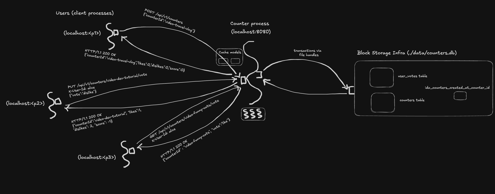

# Challenge 7 — Pagination

## Problem

In challenge 6, `GET /api/v1/counters` returns *every* counter. That's fine for our 3 seeded rows. It's fatal when there are 100,000 rows:

- The response JSON gets huge (megabytes per request).
- The DB has to scan the whole table for every list request.
- Clients have to parse and render the full dataset just to show the first page.
- Memory pressure on both server and client spikes.

Challenge 7 fixes this with **pagination** — splitting the result into bounded pages, with a cursor to navigate from one page to the next.


## Product

`GET /api/v1/counters` now takes two optional query parameters:

| Param | Default | Notes |
|-------|---------|-------|
| `limit` | 20 | Number of items per page. Max 100. |
| `cursor` | none | Opaque token from the previous page's `nextCursor`. Omit to get the first page. |

And the response shape changes from a bare array to an object:

```json
{
  "counters": [
    { "counterId": "video-funny-cats", "likes": 2, "dislikes": 0, "score": 2, "createdAt": 1776650971 },
    ...
  ],
  "nextCursor": "MTc3NjY1MDk3Mjo6dmlkZW8tZGV2LXR1dG9yaWFs"
}
```

- `counters` — the current page's items, newest first (`created_at DESC`).
- `nextCursor` — opaque string to pass as `?cursor=` in the next request. **Omitted** when you've reached the last page (null-valued, stripped from the JSON by Jackson).

Clients paginate by following cursors:

```
GET /api/v1/counters                        → { counters: [...20...], nextCursor: "..." }
GET /api/v1/counters?cursor=...             → { counters: [...20...], nextCursor: "..." }
GET /api/v1/counters?cursor=...             → { counters: [...7...] }     ← no cursor, last page
```

Other endpoints (`GET /{id}`, `POST`, `DELETE`, `PUT /{id}/vote`, etc.) are unchanged. Single-counter responses now include a `createdAt` field since that's a real property of a counter now.


## Programming

### Run-time — What's Actually Happening



#### Data

The wire changes on the list endpoint:

```
GET /api/v1/counters?limit=3
    → HTTP 200
    { "counters": [c1, c2, c3], "nextCursor": "abc123" }

GET /api/v1/counters?limit=3&cursor=abc123
    → HTTP 200
    { "counters": [c4, c5, c6], "nextCursor": "def456" }

GET /api/v1/counters?limit=3&cursor=def456
    → HTTP 200
    { "counters": [c7] }     ← no nextCursor, means last page
```

The cursor is an **opaque string** from the client's perspective. Internally it's `(createdAt, counterId)` base64-encoded — the client doesn't need to know or care.

Each counter now carries a `createdAt` field (Unix seconds since epoch). That's the new data on the wire — a timestamp clients didn't see before. In the DB, it's an INTEGER column we added this challenge.

#### Process

The list endpoint now runs a **keyset query** instead of "scan the whole table":

```sql
-- First page
SELECT ... FROM counters
ORDER BY created_at DESC, counter_id DESC
LIMIT 21

-- Subsequent pages (using cursor (cursorCreatedAt, cursorCounterId))
SELECT ... FROM counters
WHERE created_at < :cursorCreatedAt
   OR (created_at = :cursorCreatedAt AND counter_id < :cursorCounterId)
ORDER BY created_at DESC, counter_id DESC
LIMIT 21
```

A few mechanics worth naming:

- **We fetch `limit+1` rows, not `limit`.** If we got back more than `limit`, there's another page; the extra row is trimmed and its key becomes the `nextCursor`. If we got `limit` or fewer rows, we're on the last page.
- **The tuple comparison is expanded** (`created_at < X OR (created_at = X AND counter_id < Y)`) because SQLite doesn't reliably support the `(a, b) < (c, d)` syntax some other DBs have. Same semantics, more verbose.
- **The `(created_at DESC, counter_id DESC)` index** on the `counters` table makes this O(limit) — the DB walks the index, grabs the next 21 entries, done. Without the index, SQLite would have to scan the entire table, sort it, and walk to the right offset — defeating the point.
- **No caching.** List queries skip the cache entirely (same as challenge 6). Caching paginated pages is doable but tricky (invalidation across pages is complex), and the marginal benefit over direct DB access with a good index is small. Single-counter reads (`GET /{id}`) *are* still cached — those are the hot reads.

Write operations are unchanged from challenge 6 — create, delete, vote, clear-vote still work via transactions, still invalidate the counter cache.

#### Infrastructure

Same as challenge 6 — one process, SQLite file on disk, Dropwizard on port 8080, connection pool of 1, in-memory Caffeine caches for single-counter reads.

One small schema change:
- `counters` table has a new column: `created_at INTEGER NOT NULL DEFAULT 0`.
- A new composite index: `idx_counters_created_at_counter_id ON counters(created_at DESC, counter_id DESC)`.

The schema change is done inline with `CREATE TABLE IF NOT EXISTS` + `CREATE INDEX IF NOT EXISTS`. If you've already run an older challenge and have a pre-existing `counters.db` file without the `created_at` column, you'll need to delete it (`rm data/counters.db*`) and let the server recreate it. The proper fix — schema migrations via Flyway — lands in challenge 10.


### Compile-Time — How to Implement It

The changes from challenge 6 are focused:

| File | Change |
|------|--------|
| `Counter` | Added `createdAt` field |
| `db/CounterEntity` | Added `createdAt` field |
| `db/CountersDAO` | Added `listFirstPage` and `listAfterCursor`; updated `insert`, `get`, `listAll` to include the column |
| **`PageCursor` (new)** | Encodes/decodes `(createdAt, counterId)` as base64 |
| `CounterHelper` | `list()` now takes cursor + limit, returns `PageResult` (current items + optional `nextCursor`) |
| `model/CounterResponse` | Added `createdAt` field |
| **`model/CounterListResponse` (new)** | DTO with `counters` list + optional `nextCursor` |
| `CounterResource` | `@GET /` accepts `?cursor=...&limit=...`, returns `CounterListResponse` |
| `CounterApplication` | Schema has `created_at`, index, seeds timestamps |
| `index.html` | Reads `data.counters` instead of treating the response as a bare array |

Unchanged: `UserVote`, `UserVoteEntity`, `UserVotesDAO`, `VoteRequest`, `MyVoteResponse`, `CreateCounterRequest`, `CounterConfiguration`, `DatabaseHealthCheck`.

#### The model: `PageCursor` (new)

A small record with encode/decode methods:

```java
public record PageCursor(long createdAt, String counterId) {
    public String encode()         { /* base64(createdAt + "::" + counterId) */ }
    public static PageCursor decode(String encoded) { /* reverse */ }
}
```

It's a model — it represents state (a position within an ordered list). Its methods are accessor-shaped (encoding, decoding — reversible transformations of its own state). It passes the portability test: a cursor string is literally what travels across the wire, and we could serialize or send it anywhere.

Crucially, the cursor is **opaque to clients**. They don't parse it. They get one in a response and send it back verbatim in the next request. That lets us change the internal encoding — switch to JSON, sign it, encrypt it, swap in a different ordering key — without breaking any client that already received one.

#### The library: `CounterHelper` (updated)

The `list` method gains two arguments and returns a `PageResult`:

```java
public PageResult list(Optional<String> cursorString, int limit) {
    List<CounterEntity> page = jdbi.withHandle(h -> {
        CountersDAO dao = h.attach(CountersDAO.class);
        if (cursorString.isEmpty()) {
            return dao.listFirstPage(limit + 1);
        }
        PageCursor c = PageCursor.decode(cursorString.get());
        return dao.listAfterCursor(c.createdAt(), c.counterId(), limit + 1);
    });

    boolean hasMore = page.size() > limit;
    List<CounterEntity> items = hasMore ? page.subList(0, limit) : page;
    List<Counter> counters = items.stream().map(this::toModel).toList();

    Optional<String> nextCursor = Optional.empty();
    if (hasMore) {
        CounterEntity last = items.get(items.size() - 1);
        nextCursor = Optional.of(new PageCursor(last.createdAt(), last.counterId()).encode());
    }
    return new PageResult(counters, nextCursor);
}
```

The `limit + 1` trick is worth staring at: by asking for one extra row, we learn whether there's a next page *without* running a second "count" query. If the result has more than `limit` rows, there's more; otherwise, we're on the last page. One query, everything we need.

`PageResult` is a small record at the bottom of `CounterHelper`:

```java
public record PageResult(List<Counter> counters, Optional<String> nextCursor) {}
```

It's effectively a private model used as the return type of `list`. Could live in `model/` package for consistency; kept near the helper for now since it's only the helper's concern.


## Run It

```bash
cd challenge-7-counter-server-process
mvn clean package
java -jar target/challenge-7-counter-1.0-SNAPSHOT.jar server config.yml
```

### Try pagination

```bash
# Create a few extra counters so there's something to paginate
for i in $(seq 1 7); do
  curl -s -X POST \
    -H "Content-Type: application/json" \
    -d "{\"counterId\":\"video-gen-$i\"}" \
    http://localhost:8080/api/v1/counters > /dev/null
done

# Page 1 (limit 3)
curl "http://localhost:8080/api/v1/counters?limit=3"
# → { "counters": [ ...3 items... ], "nextCursor": "..." }

# Follow the cursor to page 2
CURSOR=$(curl -s "http://localhost:8080/api/v1/counters?limit=3" | \
         python3 -c "import sys, json; print(json.load(sys.stdin)['nextCursor'])")
curl "http://localhost:8080/api/v1/counters?limit=3&cursor=$CURSOR"

# Last page has no nextCursor
curl "http://localhost:8080/api/v1/counters?limit=100"
# → { "counters": [ ...all 10... ] }   (note: no nextCursor key)
```

### Observe the ordering

The seeded counters are inserted at startup with timestamps 1, 2, 3 seconds apart. Any counters you create afterwards have later timestamps. The list returns in `created_at DESC, counter_id DESC` order — newest first, with `counter_id` breaking ties when timestamps match (e.g., two counters created within the same second).

### Validate inputs

```bash
curl -i "http://localhost:8080/api/v1/counters?limit=0"       # → 400 Bad Request
curl -i "http://localhost:8080/api/v1/counters?limit=101"     # → 400 Bad Request
curl -i "http://localhost:8080/api/v1/counters?cursor=garbage" # → 400 Bad Request
```


## What's Missing

- **Schema migrations** — we're still hand-rolling schema setup with `CREATE TABLE IF NOT EXISTS`. Adding the `created_at` column for an existing DB required a manual file deletion (for our teaching case). In production, you'd use Flyway/Liquibase to version and track schema changes. Challenge 10 introduces this alongside the move to Postgres.
- **Filtering and sorting** — the list endpoint returns *all* counters in one fixed order. Real APIs let clients filter (`?user=alice`, `?minScore=10`) and sort (`?sort=score:desc`). Each of those interacts with pagination in non-trivial ways — indexes must support the combined query shape.
- **Total count** — we don't return "total items" or "total pages." For keyset pagination that's intentional: computing a total requires scanning the full set (which the whole design was trying to avoid). Modern APIs usually skip totals or provide them as an expensive separate endpoint.
- **Backward navigation** — our cursors only go forward. To jump back, you'd need a `prevCursor` field (trivial to add, just reverse the WHERE clause direction). Most APIs skip this — clients usually cache the previous pages themselves.


## Notes

A few things worth noticing about this design:

- **Cursors are opaque; the client must not parse them.** This is load-bearing. If clients start depending on the internal format, we can never change it. Keeping cursors opaque means we can rewrite the encoding, switch from base64 to JWT-signed tokens, add expiry, whatever we want — without breaking anyone. Public APIs that leak cursor internals (Twitter used to; many Mongo-backed APIs do) end up locked into early decisions.
- **Keyset pagination is O(limit), offset pagination is O(offset).** Offset gets linearly slower as you page deeper because the DB has to scan-and-discard. Keyset stays fast regardless of depth because it's doing an indexed seek. At 10 million rows, offset=9,999,900 takes seconds. Keyset at the 500,000th page takes milliseconds. This is why every serious API uses keyset.
  
  Why does offset get slow? `OFFSET 9,999,900` literally means "walk through 9,999,900 rows and throw them away, then give me the next 20." The DB has no way to *skip* those 9.9M rows — it has to read through them in order to find the offset. Every page gets more expensive than the last.
  
  Why is keyset constant-time? The cursor says "start from row X." With a matching index, the DB does an O(log N) B-tree lookup to find X, then walks forward by `limit`. Page 1, page 1,000, and page 1,000,000 all do the same amount of work.
- **Keyset is stable under concurrent writes; offset is not.** If a new counter is inserted while a client is paginating through with offset, pages can contain duplicates or skip items (because every later row shifts by 1). Keyset has no such issue — the cursor is tied to a specific row's position in the ordering, which doesn't change when new rows are inserted elsewhere.
  
  Concrete example: client fetches page 1 at `OFFSET 0 LIMIT 3` and gets rows `[A, B, C]`. Before they fetch page 2, someone inserts a new row `X` at the top. The table's positional indices all shift down: what was row 4 is now row 5, etc. The client's request for `OFFSET 3` now returns `[C, D, E]` — `C` shows up *twice*. If instead a row is *deleted* before page 2, the client would skip an item (positions shift up, and the offset lands past the row they should have seen).
  
  Keyset avoids this by referring to rows by *content* (their sort-key values) rather than *position*. Inserts and deletes elsewhere in the table don't move the content. The cursor "last seen was created_at=98, id=h" still has a precise meaning regardless of what happens around it.
- **The `limit+1` trick avoids a separate count query.** Without it, figuring out "is there a next page?" either requires fetching everything (defeats pagination) or a `SELECT COUNT(*)` (an extra query every time). `limit+1` answers "is there more?" as a side effect of the data fetch itself.
- **The composite index is doing the heavy lifting.** Without `idx_counters_created_at_counter_id`, SQLite would have to scan the full table and sort it every time. With the index, the query plan is "walk the index starting from the cursor position, take 21 entries, done." This is why pagination + index design always go together — one without the other is either broken or slow.
  
  A database index is a separate B-tree structure that stores `(column_values → row_pointer)` entries in sorted order. Our index sorts `(created_at DESC, counter_id DESC)` — *exactly* the ordering our pagination query needs. So the DB doesn't have to sort at query time; the index already is the sort. It just walks it.
  
  The column order in the index matters. `(created_at, counter_id)` supports our query; `(counter_id, created_at)` — same columns, different order — would not, because it would sort the data first by id, which isn't our pagination order. The index's column order must match the query's `ORDER BY` order for the index to apply.
  
  This is why "pagination design" is really "index design in disguise." Every paginated API has a sort key (the `ORDER BY`), and the right index for it. Missing the index turns a millisecond query into a multi-second table scan — not a bug, a design failure that shows up in production under load.
- **Why `created_at` and not `counter_id` alone?** Technically, we *could* paginate on `counter_id` alone — it's already unique, indexed (as the primary key), and pagination would be correct and fast. The reason we don't is that `counter_id` gives you *alphabetical* ordering ("video-a" before "video-b" before "video-cooking"), which isn't meaningful to a user. Real product UIs default to "newest first" (Twitter, Reddit, notifications, blog archives, etc.), so `created_at DESC` is the natural user-facing ordering.
  
  The general rule: **the pagination sort key is chosen based on what ordering the user wants to see, not what's convenient for the database.** Common choices and their trade-offs:
  
  - `created_at` — the default "newest first" most lists want. Immutable, safe to paginate on.
  - Auto-increment `id` / ULID / UUIDv7 — time-ordered IDs that combine uniqueness with monotonicity. Common in modern systems.
  - `score` (likes − dislikes) — paginate by popularity. But score is **mutable** (changes with every vote), so cursors can become invalid mid-pagination. Only works with a good immutable tiebreaker, and you accept some ordering anomalies during traversal.
  - `counter_id` alone — correct and fast, but meaningless to users.
  
  **Immutable + monotonic + meaningful to users** is the sweet spot for a pagination key. `counter_id` is the first two but not the third; `score` is the third but not the first. `created_at` is all three — which is why it's the default.
  
  `counter_id` still matters, though — as the tiebreaker for rows sharing the same `created_at` (timestamps at 1-second resolution aren't unique). The composite key `(created_at, counter_id)` gives us meaningful ordering *and* a deterministic tiebreaker, which is exactly what keyset pagination needs.
- **Cache stays in front of single-counter reads, not list.** The caching strategy from challenge 6 still makes sense: `GET /{id}` is the hot path in real apps (every view of a video loads its counter). `GET /counters?...` is the less-hot discovery path. Caching the hot path is high-value; caching paginated pages is complex for little gain.


## Trade-off: Paginated APIs and consistency

Pagination seems simple at first — "return pages instead of everything" — but it has subtle consistency implications that are worth naming:

**1. Your snapshot isn't atomic across pages.**

A client that fetches pages 1, 2, 3 sequentially is looking at the data at three different moments. If counters are being created, deleted, or reordered in between, the client's view of the "full dataset" is inconsistent. Row X might appear on both page 1 and page 2. Row Y might never appear at all.

Keyset pagination mitigates this for *insertions at the head* (new counters come in with newer timestamps; they simply appear on page 1 next time) but doesn't fully prevent reorderings or deletions mid-traversal. That's fine for a browse UX; it's not fine if you're trying to export "a consistent snapshot of the DB."

**2. If the ordering key is mutable, cursors can become invalid.**

Our `created_at` is immutable (it's set on creation and never updated). That's deliberate. If we paginated by `score DESC` (which changes with every vote), a cursor saying "the last item I saw had score 42" could skip past rows or duplicate them as scores shift during pagination.

**Rule of thumb**: pagination keys should be monotonic and immutable (timestamps, sequence numbers, ULIDs). Never paginate by mutable fields.

**3. Deep pagination is expensive even with keyset, for different reasons.**

Keyset is O(limit) per page — but if a client fetches 10,000 pages sequentially, that's still 10,000 queries. Real APIs rate-limit deep pagination or discourage it entirely. Services like Stripe and Slack set max cursor age or limit total pages per session.

These aren't bugs in pagination — they're realities every API dealing with large datasets has to think through. Our implementation covers the happy path cleanly; the trade-offs above are what you'd want to flag in a real system's docs.
